# **数据通信1**

核心思想：积极提问，积极甩锅

## 开课知识科普：

## osi七层结结构

osi中的网络层可能会用，更详细，排错会使用osi分层排错，从底层往上层逐级修bug


### 物理层：

定义电压，接口，网线长度等

### 数据链路层：

承上启下，承担翻译官的功能，不同线路对数据包装，分为MAC层和LLC层，主要协议是PPP

##### MAC层：

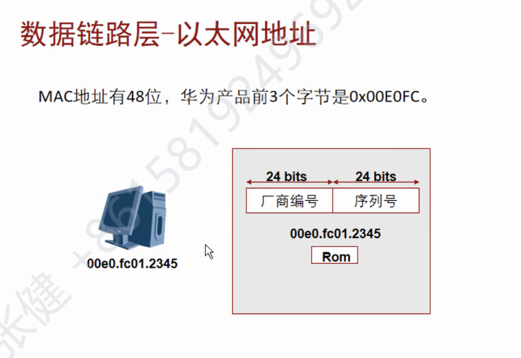

怎么找非法主机的MAC地址——ARP协议

1.先广播发送一个ARP请求

2.目标收到ARP协议后再发送一个ARP回应报文

缺点：安全性较差，可以欺骗路由器说我是他的用户，这样所有信息就跑别的地方了


二级交换机可以配ip，但它的本质工作不是这个，现在二层和三层的界限和模糊

### 网络层：

osi的网络编址不是ip（NSAP）

子网号是网络地址的一部分

网络地址是小区，主机地址是你家门牌号

#### **abc类地址分类**

已经变得不太重要了，主要还是看子网掩码

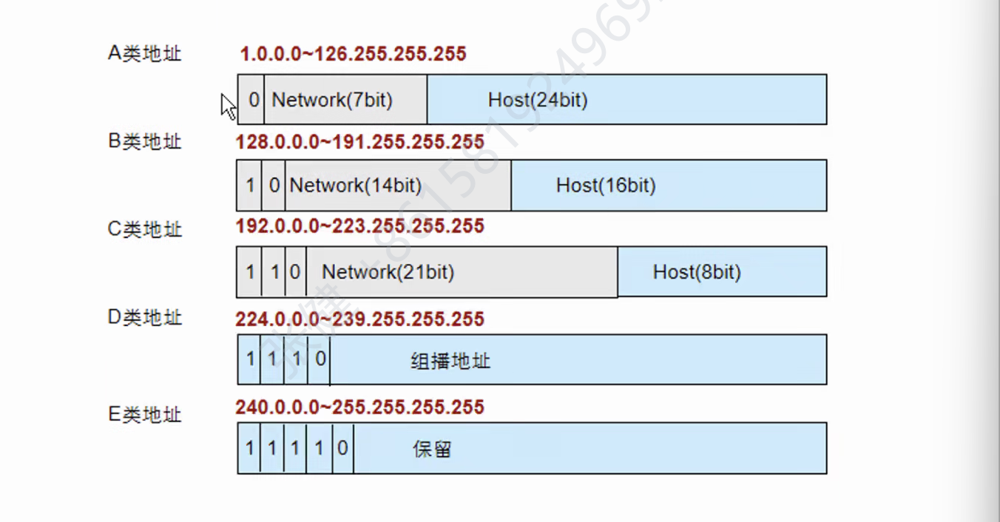

首部：0-10-110-1110

子网掩码是多少就写多少个一再补0，再将点的中间按下面转换


子网划分：

公式：2的n次方-2>=需求

n为主机位

网络位=32-主机位

例子：

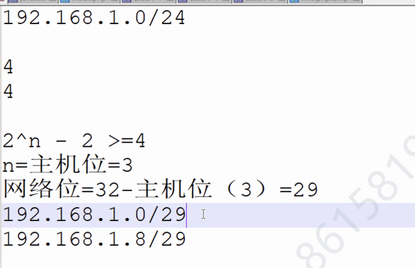

30位的一个IP给终端，一个IP给网关

一般使用的子网划分地址为172.16.和10.


#### 特殊IP地址：

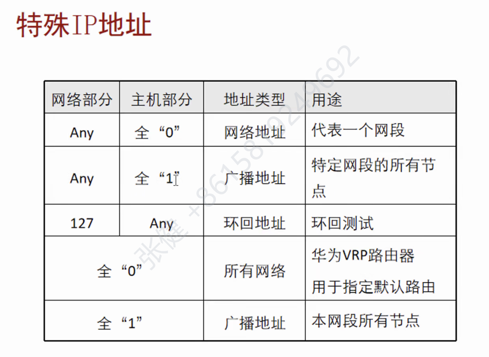

广播分为在一个网络广播和对所有主机广播

#### 私有地址：

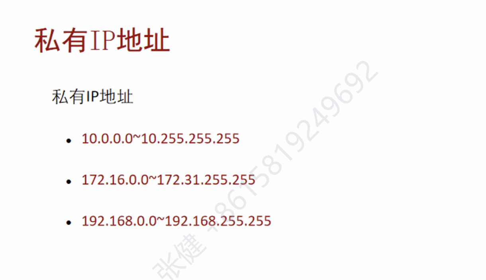

B类16的0到31的255

#### 地址聚合：

就是将二进制相同的部分当做主机位

#### 代理ARP

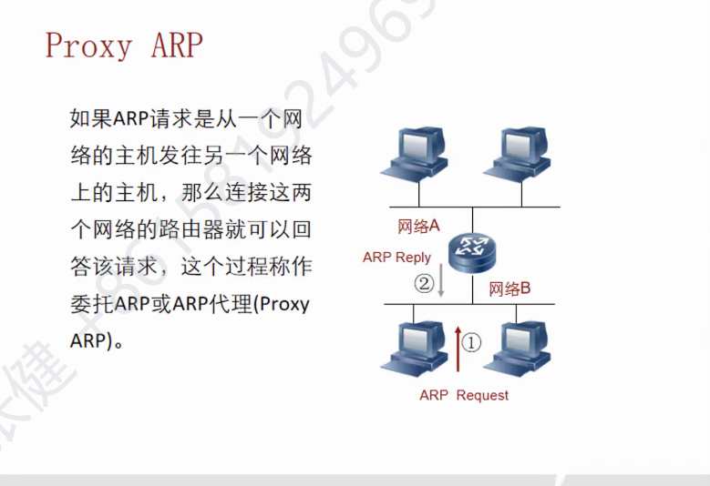

会产生ARP欺骗的类似效果

#### Gratuitous ARP


即请求自己的IP地址的MAC地址。

作用:1.验证IP是否冲突

2.更换物理网卡

#### RARP

 RARP使只知道自己硬件地址的主机能够知道其IP地址。ARP是知道IP求MAC，RARP是知道MAC求IP

#### IP

版本：不是4就是6

首部长度和总长度配合来算载荷

服务类型：TOS包括共8位，包括3 bit的优先权字段（取值可以从000-111所有值），4 bit的TOS子字段和1 bit未用位但必须置0。

标识符：数据报由于长度超过网络的MTU而必须分片时，这个标识字段的值就被复制到所有的数据报片的标识字段中。相同的标识字段的值使分片后的各数据报片最后能正确地重装成为原数据

标志：标志字段中的最低位为MF（More Fragment）。MF=1即表示后面“还有分片”的数据报。MF=0表示这已是若干数据报片中的最后一个。

  标志字段中间的一位记为DF（Don't Fragment），意思是“不能分片”。只有当DF=0时才允许分片。

片偏移：**片偏移指的是较长的分组在分片后，某片在原分组中的相对位置**

生存时间： 每经过一个路由器减一

协议：嗯记，每个协议有特定的数字，例如TCP（6），UDP（17）


### 传输层：

经典——TCP/UDP，除此之外还有很多其他的协议，如OSPF

#### tcp首部格式

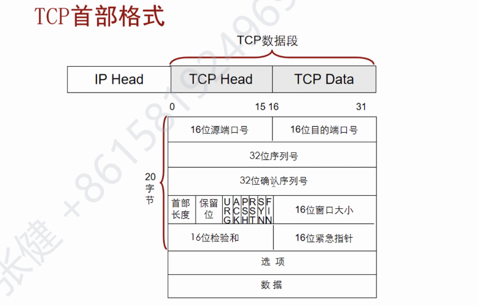

#### 三次握手：

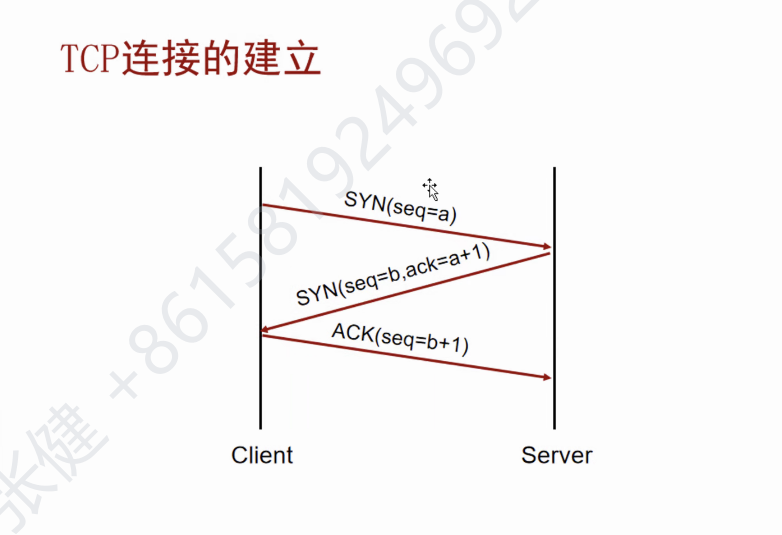

这里是显式确认

用户希望a，对方回应确认a+1，希望得b，用户回应确认b+1

//后来补充，每个步骤相对应的状态机


客户端发出syn请求（a），进入**syn_sent状态**，对方接收到后回复a+1的ack,进入到**SYN—RCVD状态**，并且要求对方回复b，客户端接收到后回复b+1，**进入到establish状态**，对方**接收到后也成为establish状态**

#### 四次挥手

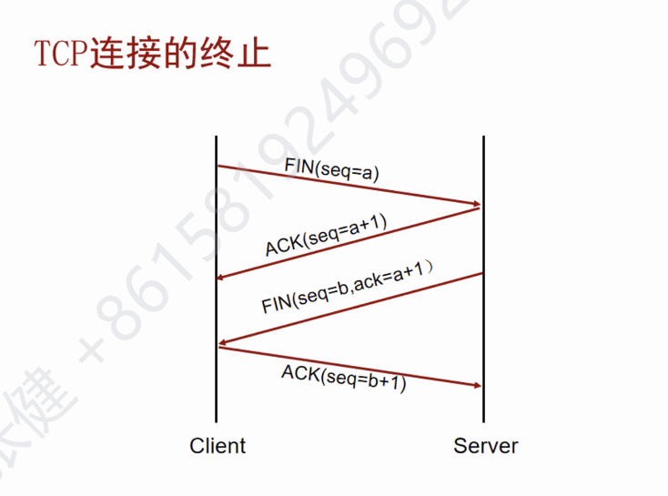


tcp是建立在IP不可靠上的，tcp用三次握手和四次挥手来保证可靠传输

建立**连接后大家都是establish状态，**接着客户端**发起结束请求**，**进入FIN-WAIT1状态**，发送u，对方**接收到后进入到CLOSE-WAIT**状态，并且回复u+1，对方**接收到后进入FIN-WAIT2状态，**接着服务端再发送最后确认信号seq=w，进入**LAST—ACK状态**，对方接收到后**进入TIME-WAIT状态**，发送w+1，**等待一段时间后进入CLOSED状态**，对方服务器**接收到回复后进入到CLOSED状态**

#### UDP的首部格式

与TCP对比

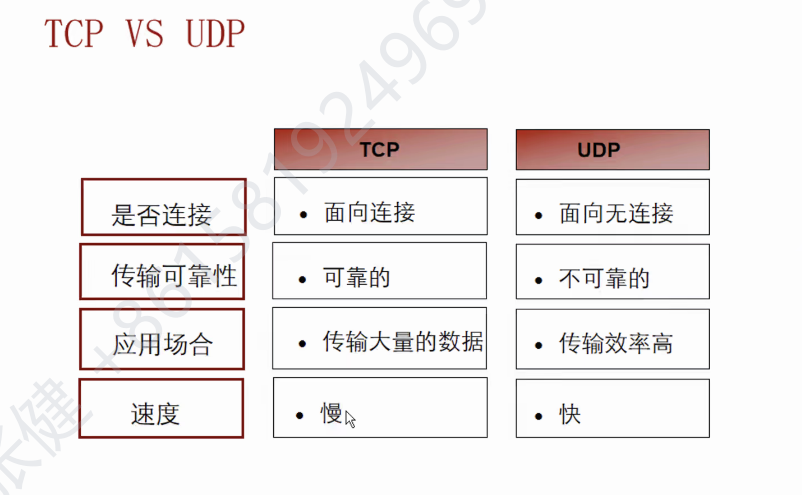


机房：

列头柜不要摸，380v高压！！！

接口：FC，SC，LC，ST

光纤：靠颜色区分，黄色是单模（SM）光纤（1310nm），多模光纤（850nm）：om1，2（橘黄色）om3（蓝色），om4（紫色）

## 设备配置

1.console配置--实地配置

2.telent配置--远程配置

配置方式：1.仅靠密码控制

```c
<Quidway>system-view -----进入配置模式
[Quidway]interface vlan 1 -----进入管理vlan
[Quidway-Vlanif1]ip address 192.168.28.49 255.255.255.0 -----配置管理ip地址
[Quidway-Vlanif1]quit -----退出
[Quidway]telnet server enable -----打开telnet服务 （一般默认开启）
[Quidway]user-interface vty 0 4 -----用户指定虚拟用户终端接口
[Quidway-ui-vty0-4]authentication-mode password -----配置用户终端接口认证方式 密码验证
[Quidway-ui-vty0-4]set authentication password cipher huawei123 -----设置接口验证密码,密码为huawei123
[Quidway-ui-vty0-4]user privilege level 15 -----设置用户优先级 （可选）
[Quidway-ui-vty0-4]idle-timeout 1 -----设置登陆超时为一分钟 （可选）
[Quidway-ui-vty0-4]return -----返回用户视图
<Quidway>save -----保存
```

2.用户名加密码控制（aaa）

```c
<Quidway>system-view -----进入配置模式
[Quidway]interface vlan 1 -----进入管理vlan
[Quidway-Vlanif1]ip address 192.168.28.49 255.255.255.0 -----配置管理ip地址
[Quidway-Vlanif1]quit -----退出
[Quidway]telnet server enable -----打开telnet服务 （一般默认开启）
[Quidway]user-interface vty 0 4 -----用户指定虚拟用户终端接口
[Quidway-ui-vty0-4]authentication-mode aaa -----配置用户终端接口认证方式 aaa验证
[Quidway-ui-vty0-4]user privilege level 15 -----设置用户优先级
[Quidway-ui-vty0-4]idle-timeout 1 -----设置登陆超时为一分钟
[Quidway-ui-vty0-4]quit -----退出
[Quidway]aaa -----进入aaa
[Quidway-aaa]local-user huawei password cipher huawei123 -----创建用户名huawei 密码huawei123
[Quidway-aaa]local-user huawei privilege level 15 -----设置用户优先级
[Quidway-aaa]local-user huawei service-type telnet -----授权用户使用telnet
[Quidway-ui-vty0-4]return -----返回用户视图
<Quidway>save -----保存
```

实验远程连接成功：

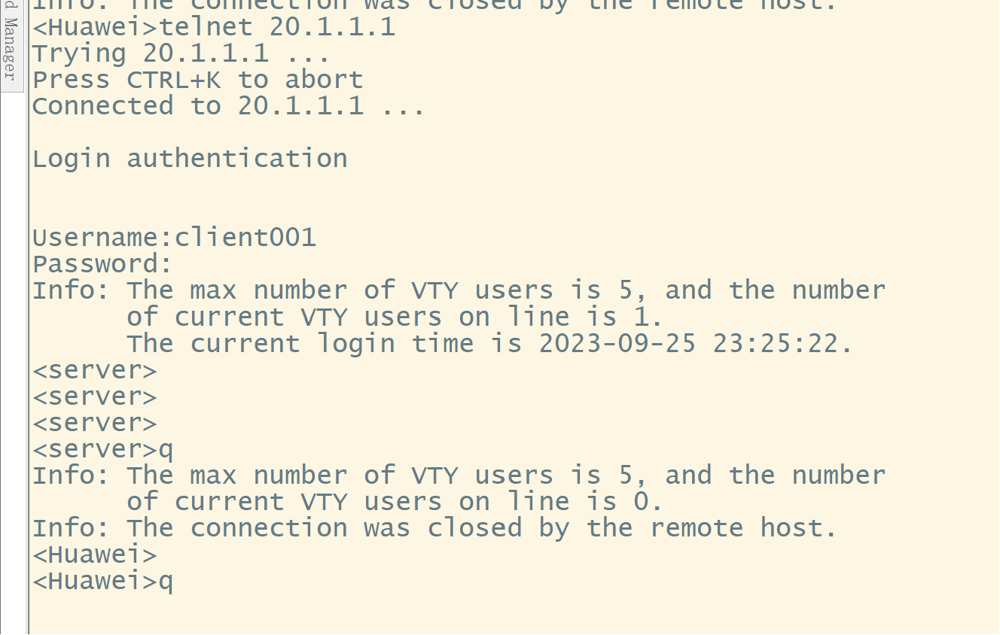


3.ssh,类telnet，但是更加安全

配置方式：1.账号密码方式（与telnet差不多，略）

2.密钥控制:

1. 服务器端生成本地密钥对
   ecc local-key-pair create
2. 配置VTY用户界面

user-interface vty 0 4

 authentication-mode aaa

 user privilege level 3

protocol inbound ssh

3. 创建SSH用户Client001，ecc认证（自己取名字）

SSH Server:
ssh user client001
ssh user client001 authentication-type password

4. 客户端先生成一个本地密钥对

SSH Server:
sysname client002
ecc local-key-pair create

5. 查看密钥信息

display ecc local-key-pair public

6. 想办法将密钥复制发送到服务器端，再输入保存在服务器里

```c
SSH Server:
ecc peer-public-key 1.1.1.1//
 public-key-code begin//
  0400CB04 85C462A2 2169E6B4 CD089C0D 4E27A587 C7D8AAE3 A3FD2714 A7414857
  747BC1F8 E4797A8E CBA0FCE6 475260FE BB5F3C5B 219594DF D7A59B3C 1C5CEEA2
  6ADD5400 B10DF3F1 DDC7A255 38A27469 2BD67DBD AE0A0B40 C3B9C7DC 6D7C83DD
  5FBB3E84 CC057512 1B6D652B 1E722161 3915932B 003C2B7E CC591551 4A4F31E1
  5D5E140E F9（这段就是密钥）
 public-key-code end//
 peer-public-key end//
```

7. 服务端为这个密钥起名字并与用户绑定,打开stelnet服务
   ssh user client002 assign ecc-key ecckey001

		stelnet server enable

8. 首次认证并连接
   ssh client first-time enable

		stelnet 1.1.1.1

（rsa与ecc配置命令类似）


## 问题：

asl，qs，mpo是啥？


代理ARP？

**代理ARP**是 ARP协议 的一个变种。 对于没有配置缺省网关的计算机要和其他网络中的计算机实现通信，网关收到源计算机的 ARP 请求会使用自己的 MAC 地址与目标计算机的 IP地址对源计算机进行应答。 代理ARP就是将一个主机作为对另一个主机ARP进行应答----度娘

## 


# 数据通信2

[TOC]


## ICMP（互联网控制信息协议）

### 介绍

ping以及traceroute工作基于icmp，icmp是网络层协议，如果某个包丢失了，那么icmp报文就要把丢失原因告知

### ping使用icmp的流程

1. 源服务器向目的服务器发送ICMP回显请求消息数据包
2. 目的服务器发送回显应答
3. 源服务器显示相关数据

### traceroute命令

1. 首先 traceroute 会将 IP 包的 TTL 设置 为 1，然后发送 UDP 包，他会填入一个端口号（不可达）作为 UDP 目标端口号（默认是：33434-33534）
2. 当目的主机收到 UDP 包后，会返回 ICMP 差错报文消息（类型 3，代码 3）。参照上面的表，该错报文类型是端口不可达，说明发送方发出的 UDP 包到达了目的主机（该报文中含有IP地址）

3. *有的路由器禁用 ICMP ，那么他就根本不会返回这个 ICMP 差错报文，所以是看不到中间经过的路由IP的。
4. traceroute 在类 Unix/Linux 系统中默认使用的是 UDP 协议，也可以通过参数修改为使用 ICMP 协议；Windows 操作系统中只使用 ICMP 协议

*有时候ApingB可以通，但是反过来就不行了，可能是B的防火墙把ICMP过滤掉了，但是把ICMP封装到UDP或者TCP就可以了

### 协议类型

ICMP有type码和code码


## FTP-Client


路由器启动会从硬盘读取一个镜像然后启动操作系统（.bin） 更换系统就是把它的这个镜像文件替换就好了


### 换镜像操作：

1. 搭建FTP服务器（网络上有很多这种视频帮助搭建，例如windows的 IIS）

2. 配置和镜像都要备份（FTP加自己的IP地址）
3. put（上传）加路径就能把配置上传到你的云上
4. 从服务器下载镜像文件更换

## 文件管理FTP

1. 配置路由器Ip
2. 服务器端配置ftp的用户名和密码
3. 服务器开启ftp服务
4. 客户端登陆ftp服务器，dir查看路径，get下载

## 

## DHCP（UDP）

本质：配IP

### 简介：


### 特点：


ipv6时代DHCP更加不可或缺

DHCP租期不易过长，不然会有大量IP被占用（占着茅坑不拉屎）--两小时推荐

### DHCP系统组成


### DHCP的地址分配方式


### IP地址的动态获取过程


1. discover--能不能给我分配一个ip地址？
2. offer--给它一个IP地址
3. request--我能不能用这个IP？
4. ack（允许）--nak（不允许）

## DHCP实验

### 基于端口

*进入端口，配置pool，打开服务


1. 首先最关键的就是将路由器的端口ip配置

2. 打开dhcp服务

3. 配置地址池，也就是网段，主机会被分配到这些ip地址中的其中一个（元素：网段，网关，dns地址，租约时间）

4. 排除不需要的地址

5. 主机启动dhcp模式，输入ipconfig查看获取的ip地址

   

### 全局DHCP

*配置pool，进入端口，打开全局

*图片案例同上

1. 还是先为端口配置ip地址
2. 接着创建地址池（IP pool 1）
3. 为这个地址池配置元素（网段，网关，dns服务器，租约）


4. 排除不分配的地址
5. 为接口启动全局dhcp服务##
6. pc机输入ipconfig查看分配的ip地址

### 中继DHCP

*配置服务器端口pool，声明下一跳，网关路由连上服务器端口


分为了服务端路由器和网关路由（中继）

#### 服务器

1. 端口配置ip
2. 关键：告知路由器要到达某一网段的下一跳在哪（静态路由：ip route-static 192.168.1.0 255.255.255.0 10.0.0.2）
3. 接着就是配置pool池的元素（网段，网关，dns服务器，排除ip，租期时间）

```
ip pool vlan100//pool池创建
 gateway-list 192.168.100.254 //网关
 network 192.168.100.0 mask 255.255.255.0 //地址段
 excluded-ip-address 192.168.100.99 //保留地址
 lease day 0 hour 3 minute 0 //设置租期
 dns-list 114.114.114.114 //dns
#
```


4. **为端口打开全局DHCP服务（很容易忘记）**

dhcp select global

#### 网关路由

1. 接口配置ip
2. 在端口做代理，指明（绑定）dhcp服务器的端口


## 华为设备密码破解

*user-interface 是管理接口

#### 背景

*如果进入端口后启动aaa模式然后一直quit，就会登不上设备（用户名和密码都没有设置）

#### 实验

ensp做不了

1. 交换机断电重启，按ctrl+b（华为设备一般账号名admin，密码为admin@huawei，忘记了就打咨询电话）
2. 在bootrom 中选择清除console密码


3. 确认后选择模式1启动，设置新的密码

## LLDP

通过打开协议将不清晰的网络架构生成出来

display lldp neighbor brief----查看一个设备所有接口的连接情况

display lldp neighbor interface g0/0/0----查看某一具体接口连接情况


步骤：

1. 远程控制其中的一台设备
2. display lldp neighbor brief查看一个设备所有接口的连接情况


3. 画大致的拓扑图，再进入具体接口看IP：display lldp neighbor interface g0/0/0----查看某一具体接口连接情况

4. 重复前三点，直到拓扑完善

*注意：有些线路可能无法显示，解决方法是？

## VLAN技术

1. 创建vlan （vlan 2或者 vlan batch 2 3）
2. 进入端口
3. 切换模式为access
4. 划分vlan（port default vlan 2）

逻辑上将一个大的交换机划分成两个以上，两个不同的vlan间无法正常通信

## hybrid端口

拥有两个列表------TAG和UNTAG，在TAG列表中的编号的数据打上标签进行转发，在UNTAG列表中的编号的数据剥夺标签转发

## VLAN标签


802.1q或者串口封装为vlan打上标签

vlan数量1-4094

本征vlan不打标签（一般将用不到的vlan设置成本征镜像vlan）

arp会从非接收端先广播发送给相同vlan的部分再发送到trunk口

*两个交换机的本征vlan必需相同，不然很可能丢包（port trunk vid 2）

---

# 数据通信3

## VLAN路由

不同vlan不能通信，划分成了不同的广播域和网段（虚拟）


创建vlan相当于创建了一个网段，但是还缺少了网关，而vlanif接口就解决了这个问题，就相当于vlan网络的网关，这样交换机就能将不同vlan的信息进行转发（拥有他们的ip地址）


*同网段可以通信，跨网段不能通信，可能是pc的网关没配

如果右边的pc3想pingpc4是无法直接通过sw2转发，因为没有配置vlanif接口，这个时候就要依靠左边的sw1（此时扮演的就是vlan路由）pc3通过sw2转发到sw1，sw1发现是转发给vlan2的，把标签改变再转发

## VLAN-单臂路由


配置一个不用的vlan id 是很重要的！！！

单臂路由一条线路怎么加两个以上的vlan呢？

在一个物理端口上添加虚拟端口int g0/0/0.1,dot1q terminal vid ？连上vlan，配置ip作为网关，打开arp broadcast enable

## 以太网端口技术

### 自协商


带宽很大而主机不需要这么带宽是时，路由器可以根据主机的带宽进行自协商分配带宽（auto negotiation）

**以太网的接口模式**


### 流量控制

老师省略了，查资料发现根本看不明白：)


### 链路聚合

将物理线路逻辑上聚合为一条线路

*配置一致（速度一样）* *最多八根*

*带宽做加法

1. 全局创建eth-trunk 1
2. 端口输入eth-trunk
3. 例子

优点：增大容错率，其中一个线路寄了网络不会寄；带宽增加

*注意* 逻辑上两个物理变成逻辑接口了，vlan配置都基于这个逻辑接口

#### 手动模式

指LAG不启用任何链路聚合协议，Eth-Trunk的建立、成员接口的加入由手工配置。

（手敲代码）

#### LACP模式

##### 定义

指LAG启用LACP链路聚合协议，Eth-Trunk的建立、成员接口的加入基于LACP协议协商完成。


##### 优点

由LACP确定聚合组中的活动和非活动链路，又称为M:N模式，即M条活动链路与N条备份链路的模式。这种模式提供了更高的链路可靠性，并且可以在M条链路中实现不同方式的负载均衡。（M里面哪条链路寄了就从N条中选择一条替换）

##### 实验配置

1. 交换机创建eth-trunk接口
2. 模式确认为lacp模式


3. 将端口加入到eth-trunk中，设置优先级（就是确认谁是M谁是N）


3. 设置活动接口数量（M有多少个）

   

##### 实验结果


#### 跨交换机的链路聚合

以后教

### 端口镜像

把某一个接口的数据复制到你指定的端口，相当于多播 

1. 先将你要添加的端口作为observe-port


2. 再将监听的端口mirror添加到observe-port（模式，in/out/both）


## STP的原理及配置

*一些叫法：802.1D，802.1W，802.1S（3个版本）

802.1D衍生：华为设备：STP 思科设备：PVST--->PVST+

802.1W衍生：华为设备：R（快速）STP 思科设备：PVRST

802.1S衍生：华为：MSTP

*本质上就是防止闭环

*主要是进行调优，理论知识更重要

### 交换机的转发流程


1. 先将信息来源的mac地址登记
2. 查看转发表进行转发
3. 找不到，泛洪

### 环路问题

PC机占用率拉满


在E0/3和E0/4之间反复横跳

### 原理

#### 消除环路

阻塞某一端口（无关端口）--block（仅能接收一种报文BPDU）

#### 根交换机

一个广播域选一个根交换机（判读依据：***BID=桥ID=网桥优先级（32768）+MAC地址***），比小不比大，优先级可以更改。（增量4096）

#### 根端口

一个非根桥交换机上选一个根端口


1. 开始都会发送SPDU报文进行第一次选举（比较根桥id大小）

2. 然后比较到达根桥累计路径开销（1G-20000，小的优先）
3. 第二点相同时，比较发送者桥ID（中继桥id小优先）
4. 第三点相同时，比较发送者端口（发送端口小的相连的为根端口）：端口=端口优先级（128）+端口号（只能改优先级，增量16）
5. 比较自己的端口号


#### 指定端口

一个冲突域内选一个指定端口（一般是一个网段）

先找出根交换机（root），再找出根端口（Root port），再找出指定端口（Designed port），最后生成无关端口（NP）

#### 端口状态描述


头脑风暴了哥们,这里的重启时间是真的搞不明白

从断链到重启大约需要50s


#### stp配置

*理论很烧脑，实验很简单

特殊：stp root primary/secondary（降低优先级）

一般：stp mode stp 和stp priority 4096（设置交换机的优先级）


要改变b的根端口，修改a的端口优先级（int g0/0/0  stp port priority 32）或者改b的端口开销（int g0/0/0  stp cost 2000）


## RSTP（快！）


1. 状态只有三个了


2. 端口角色变成4个


3. BPDU格式变化

## 拓扑变更

每两秒发送的bdpu（hello）是configuration报文

*TCN：topo change notification


收到TC老化时间会从300s减少到15s

这些叫flag信息


# 课后作业

## 故障排查

### 要求


### 问题来源：

1. pc的网关就ping不通,发现是vlanif地址没有配置
1. 部分pc的地址错误
1. 有些接口被shutdown了
1. 交换机3的两个接口没有配置
1. 交换机2的vlan 100 和200没有创建（马虎了没有发现导致卡了很久）
1. 同一网段接口pvid不同

## mstp(多生成树)


1. 实例--基于实例来生成二叉树
2. 每个实例包含一个或者多个VLAN
3. vlan会按照所在的生成树结构转发数据

### 单实例


```c
[Huawei]stp region-configuration 	  //进入设备的MST域视图，针对MST域的相关配置需在该视图下进行。
[Huawei-mst-region]region-name HCNP	  //修改MST域名称
[Huawei-mst-region]revision-level 1	  //将MST域的修订级别修改为1，缺省为0
[Huawei-mst-region]active region-configuration   //激活上述配置
Info: This operation may take a few seconds. Please wait for a moment...done.
[Huawei-mst-region]q
[Huawei]stp mode mstp 
[Huawei]stp root primary   //指定主根桥(或者打：stp priority 0，数字越小优先级越高)，备份桥stp secondary
[Huawei]stp enable 
[Huawei]
```

### 多实例


```c
[Huawei]stp region-configuration 
[Huawei-mst-region]region-name ##
[Huawei-mst-region]instance 1 vlan 2 to 10
[Huawei-mst-region]instance 2 vlan 11 to 20
[Huawei-mst-region]active region-configuration 
Info: This operation may take a few seconds. Please wait for a moment...done.
[Huawei-mst-region]q
[Huawei]stp mode mstp 
[Huawei]stp instance 0 root primary //按照实际设计要求设置，不同交换机主要更改这个
[Huawei]stp instance 1 root primary 
[Huawei]stp instance 2 root secondary 
[Huawei]stp enable 
//mstp配置模式-》命名，vlan添加到实例-》交换机在实例中优先级设置-》启动
```

## 综合实验

主要考察vlan划分，链路聚合和dhcp配置的知识点# 数据通信3

[TOC]


## MSTP的原理与配置

### MSTP的基本概念

问题：单个生成树的弊端---一部分VLAN路径不通/路径可能过长


stp判断向量：根交换机-路径开销--桥ID--端口ID--自己的端口id（有STP就要考虑优化问题）

### 多生成树实例


vlan2的3700和5700-B断开

vlan3的3700和5700-A断开

*每根线都得到了利用，且能够避免环路

*默认的实例为instance 0

### MSTP配置

1. 将vlan划分到不同的实例
2. 设置交换机的优先级（dis stp可以查看桥ID和路径开销），配置优先级要突出在哪一个实例下（stp instance 1 priority 0）
3. 注意：交换机可能会出bug，需要配置一个备份交换机（stp instance 1 priority 4096）


### MSTP区域


将多个交换机划分不同的区域，一个区域可以看成一个交换机，这个根桥叫域根


### 端口角色

**根端口**	在非根桥上，离根桥最近的端口是本交换设备的根端口。根交换设备没有根端口。根端口负责向树根方向转发数据。

**指定端口**	对一台交换设备而言，它的指定端口是向下游交换设备转发BPDU报文的端口。

**Alternate端口**	从配置BPDU报文发送角度来看，Alternate端口就是由于学习到其它网桥发送的配置BPDU报文而阻塞的端口。 从用户流量角度来看，Alternate端口提供了从指定桥到根的另一条可切换路径，作为根端口的备份端口。

**Backup端口**	从配置BPDU报文发送角度来看，Backup端口就是由于学习到自己发送的配置BPDU报文而阻塞的端口。 从用户流量角度来看，Backup端口作为指定端口的备份，提供了另外一条从根节点到叶节点的备份通路。

**<u>新鲜的知识点啊</u>**

**Master端口**	1、 Master端口是MST域和总根相连的所有路径中最短路径上的端口，它是交换设备上连接MST域到总根的端口。 2、 Master端口是域中的报文去往总根的必经之路。 3、 Master端口是特殊域边缘端口，Master端口在CIST上的角色是Root Port，在其它各实例上的角色都是Master端口。（在多个实例中有一个最好的路径，那么这个实例这个端口叫根端口，在其他实例之中叫master端口）

**域边缘端口**	**域边缘端口是指位于MST域的边缘并连接其它MST域或SST的端口。**

**边缘端口**	1、如果指定端口位于整个域的边缘，不再与任何交换设备连接，这种端口叫做边缘端口。2、 边缘端口一般与用户终端设备直接连接。 3、 端口使能MSTP功能后，会默认启用边缘端口自动探测功能，当端口在（2 × Hello Timer + 1）秒的时间内收不到BPDU报文，自动将端口设置为边缘端口，否则设置为非边缘端口。

**<u>alternate端口是根端口的备份，backup是指定端口的备份</u>**

****

### 边缘端口

*stp edged-port设置为边缘端口后tcn报文根本发不出来

P（提议：我要成为指定端口）

先将非边缘端口down掉，再发送提议确定新的指定端口，再恢复其他端口（？）

### 实验配置


1. stp region-configuration
2. region-name mstp（改名）
3. revision-level 1（版本）
4. instance 10 vlan 100（vlan 绑定实例）
5. instance 20 vlan 200
6. active regionconfiguration（激活配置

### 优先级（根桥）设置


vlan 100通过sw1/sw2-sw3-sw5
vlan 200通过sw1/sw2-sw4-sw5

对比两条线路发现不同点就在sw3和sw4，所以它们分别就作为实例10的根桥和实例20的根桥


这样vlan100的数据只会由sw3转发

vlan100只会由sw4转发

## 路由

**路由基于路由表进行数据转发**


问题：AR1没有PC2网段


### 路由来源

1. 静态路由(static)

pc1连pc2

IP route-static `192.168.2.0 24`(目标)`12.1.1.2`(下一跳)

IP route-static `192.168.2.0 24`(目标)`23.1.1.3`(下一跳)

pc2连pc1（去的地址打了，回来的还没打）

IP route-static `192.168.1.0 24`(目标)`23.1.1.2`(下一跳)

IP route-static `192.168.1.0 24`(目标)`12.1.1.1`(下一跳)

本地出接口模式：下一跳可以写g0/0/0

（不是点到点网络不能用，最好别用）

下一跳的ip地址（你要把数据给谁就写谁的ip地址）


2. 动态路由(具体协议名)

   

3. 直连路由(Direct)

每个交换机接口连接的网段是可以直接记录在路由表的


- 配置完成后pc1和pc2可以互通，但这不代表pc1可以ping通AR3（本质上就是看设备中路由表有没有目的地址的路由，而并不是类似于水管管道处处通畅）

- 实际上路由表正确也可能出错:crying_cat_face:

- 静态路由可以根据优先级和NQA可以做浮动路由，很方便

### 现实抓包

debug命令---debugging IP icmp verbose（可以选择参数）

`ACL可以优化debug体验`

terminal debugging

### 路由协议分类


1. 道听途说，基于跳数
2. 会将不同线路进行对比选择，线路已知，基于开销


### 路由表


不同协议之间对比优先级（开销参考不同），相同协议比较开销（地位同等才有对比的意义）

**优先级**


### 等价路由：ECMP


开销相同的时候会有多个下一跳

### 最长匹配原则


新的地址进入路由表，会优先与子网掩码大的网段先匹配

（0.0.0.0/0为默认路由-指向外网，在路由表里面兜底）

### 路由环路

默认路由配置不当容易产生路由环路


### 浮动路由

静态路由可以配置相同的目标网段但不同的下一跳，优先级设置不同即为浮动路由


## 动态路由协议

### 协议概述


### 路由泛洪


伟大的互联网分享精神：每个路由器会和自己的直连路由器分享自己的路由表，路由器将自己没有的路由添加（30s更新一次）

更新原则：

1. 覆盖：相同路径，选取跳数小的进行覆盖

2. 删除：180s后没有更新认为为无效路由，进行删除---线路断掉，发送路由更新，跳数为16跳，16跳不可达，删除！

### 路由环路


#### 解决环路方法--最大跳数16

180s才能删除，可是30s就更新一次，导致应该删除的路径跳数一直增加，一直存在

解决方法：跳数为16时即认为不可达，直接删除

#### 解决环路方法--水平分割

*我给你发的消息，你就不要再发给我了（燕子你不要走啊~）

#### 解决环路方法--路由抑制


就是某一个路由器的路由down掉后会立刻向周边路由器“投毒”，发送带16跳的路由更新


### RIP

**RIPv1基本上用不上了**

#### 协议概述


水平分割、毒性逆转、最大跳数和触发更新

#### V1和V2区别


v2是主播地址：224.0.0.9

v1是广播地址：255.255.255.255


无类：ip地址不按A,B,C类地址进行设置，不超范围就随便打，抓包有掩码

有类：按主类地址进行设置，不用写掩码，抓包也没有掩码


#### 配置


建议：加上undo summary防止多个地址合并例如10.1.1.0变成10.0.0.0

*network不仅宣告了网段，还启动了接口的rip接收和发送功能，相反的，想要手动关闭功能就用silent-interface 接口/all


#### RIP接口密码登录模式

rip authentication-mode simple ciper 357159

rip authentication-mode md5 nonstandard ciper alex357159 **1**

两边的key值要一样，认证不匹配路由表不存在

# 数据通信4

[TOC]


## 思维导图


这里的DD报文打错了，其实是DBD报文

## OSPF路由协议基础

dis ospf peer(full算建立完成)

dis ospf lsdb

ospf router-id xxxx

ospf的协议字段为89

是内部网关协议的一种，基于链路状态算法

### 基本特点

1. CIDR（无类域间路由）是一种用于对互联网IP地址进行聚合和分配的技术。它通过改变IP地址的分配方式，有效地解决了IPv4地址空间不足的问题。
2. 无路由自环
3. 收敛速度快
4. 使用IP组播收发协议数据224.0.0.5（村民）和 224.0.0.6（村长）（rip v1是224.0.0.9）
5. 支持多条等值路由
6. 协议报文认证(rip v2 的那种认证)

### 链路状态算法的路由计算过程

1. 建立邻接关系（物理和逻辑上很亲密），不等同邻居关系
2. 泛洪LSA（类似于rip的泛洪），将收到的信息放进LSDB数据库里面
3. 通过SPF算法计算最短路径树
4. 计算路由并且存入IP路由表中


### OSPF的基本概念

#### 自治系统AS

在互联网中，一个或多个实体管辖下的所有IP网络和路由器的组合，它们对互联网执行共同的路由策略

#### Router ID


很多ospf的服务需要id，来源：

1. 手动分配 2.通过活动环回口接口的最大IP 3.通过物理环回口接口的最大IP 

（没有邻接关系随便改，否则要重启）


#### 划分区域


area 0：骨干区域，有且只有一个，其他区域必须和骨干区域直连

#### 路由器分类

BR（略）: 所有接口都在area0

ABR（区域边界路由器）：一个在area0 其他的在其他区域

IR（略）：全部接口在其他区域

ASBR（自治系统边界路由器）：使用BGP连接另外一个AS


#### OSPF的五个报文

1. Hello报文
2. DD报文
3. LSR报文
4. LSU报文
5. LSACK报文

#### OSPF的七个邻居状态

1. Down
2. Init
3. Two way
4. Exstart
5. Exchange
6. Loading 
7. Full

### 实验基本配置

1. ospf 进程
2. area X进入区域配置
3. network宣告网段
4. （如果需要）设置stub区域或者nssa区域

## 进阶知识

### 邻居和邻接


当线路中出现多余的信息转发，就需要DR（村长）和BDR（副村长）

224.0.0.5---其他路由器给DR发信息

224.0.0.6---DR给其他路由器发信息

### DR和BDR的选举过程

其他路由器只会和DR建立邻接关系

1. 一开始是先选举BDR，如果发现区域没有DR就成为DR

2. DR寄了之后BDR成为新的DR，然后再将id大的改为BDR

### OSPF支持的网络类型

点对点通信，广播通信，多播，NBMA

（p2p和p2mp不进行DR和BDR的选举--两个人还选什么村长）

（广播和NBMA进行DR和BDR的选举）


那么我们怎么更改类型呢？

1. 进入接口

2. ospf network-type xxx


两个接口不一致时只可以建立邻接关系，但是不能交换路由条目


### 邻居建立

##### 邻居状态


1. down
2. attempt（nbma里面会出现）
3. int：向外发送hello包（空包，没有地址，有自己的router-id），对方收到hello包再回复它的router-id，进入到2-way
4. 2-way（选DR，BDR）：能进入2-way的条件是收到的hello中有自己的router-id
5. exstart(选master和servant)：2-way进start条件：1. 选完BDR（第一个BDR会立刻成为DR）2. 等待40s 3. 不选DR和BDR的链路跳过2-way进入exstart

显示确认：ack发1回2，发2回3

隐式确认：发送序列号为1，回复的数据包也得是1


DBD：类似书本的目录，进行master的选举，servant的序列号改为master的序列号


6. exchange交换DBD包（有内容）

7. loading：我给你发request，你给我回update


##### 邻居关系建立

1. **router-id不能相同**
2. 区域必须相同
3. 认证类型必须相同，密码也要相同         
4. 直连接口掩码必须相同
5. hello包，死亡时间必须设置一样
6. **直连路由器接口不能同时设置接口优先级为0**
7. 相同区域的路由器的LSDB必须保持一致（几类LSA相同）
8. 两端mtu的值应该设置成一样


### LSA（6种常见）

不是一种报文类型，全部放在LS update报文中

#### Router-LSA（1）

Router-LSA是一种最基本的LSA，即Type1 LSA。

OSPF网络里的每一台路由设备都会发布Type1 LSA。这种类型的LSA用于描述设备的链路状态和开销，在路由器所属的区域内传播。


#### Network-LSA（2）

Network-LSA，也就是Type2 LSA，由DR（Designated Router）产生，描述本网段的链路状态，在所属的区域内传播。如图所示，R3向R2发送一条Network-LSA，列出了所有与DR形成完全邻接关系的路由器的Router ID。


 


#### Network-summary-LSA（3）

Network-summary-LSA，也叫Type3 LSA，由ABR发布，用来描述区域间的路由信息。ABR将Network-summary-LSA发布到一个区域，通告该区域到其他区域的目的地址。实际上，ABR是将区域内部的Type1和Type2的信息收集起来并汇总之后扩散出去，这就是Summary的含义。如图所示，R2作为ABR，将Area 0和Area 1中的路由信息分别发布对方区域。


#### ASBR-Summary-LSA（4）

ASBR-summary-LSA，也叫Type4 LSA，由ABR发布，描述到ASBR的路由信息，并通告给除ASBR所在区域的其他相关区域。如图所示，R3作为ABR通告ASBR-summary-LSA到Area 0中。


 

#### AS-external-LSA（5）

AS-external-LSA，也叫Type5 LSA，由ASBR产生，描述到AS外部的路由，通告到除Stub区域和NSSA区域以外所有的区域。如图所示，R4作为ASBR发布了一条OSPF AS到外部目的网络的路由信息。


#### NSSA LSA（7）

除了上述几种LSA之外，还有一种比较特殊的LSA，NSSA LSA，也叫Type7 LSA。NSSA LSA由ASBR产生，描述到AS外部的路由，仅在NSSA区域内传播。NSSA区域的ABR收到NSSA LSA时，会有选择地将其转化为Type5 LSA，以便将外部路由信息通告到OSPF网络的其它区域。


## 实验配置

### 虚连接的配置


区域2没有和区域0相连，区域0和1就无法获取到区域2的路由信息，需要配置虚拟连接以获得area2的路由信息


area2要经过area1和area0连接，所以在area1中设置


在AR2中指向Ar3（v-link peer #router-id）

AR3中指向AR2（v-link peer #router-id）


vlink和回环路由？？？

### OSPF特殊区域

末梢路由就是只与一个路由器连接


stub：不接受4类，5类，7类LSA

totally stub：不接受3，4，5，7类LSA


NSSA（Not-So-Stubby Area）：不接受4，5 LSA类

**与nssa区域连接的abr在收到七类的lsa会转成5类**

totally NSSA 区域：不接受3，4，5


#### 实验配置

##### stub

就在区域的两台路由器里面打个stub就好了

进入区域，输入stub

##### nssa

就在区域的两台路由器里面打个nssa就好了

进入区域，输入nssa

### ospf下放默认路由


#### 手动配置

在路由器的ospf进程下下放默认路由

```
ospf
default-route-advertise
```


#### 特殊区域配置

基于上面的特殊区域的后stub和nssa会自动下发默认路由（注意协议优先级，若已经有了优先级更高的协议产生的默认路由则不会显示）

stub路由表


NSSA路由表


### ospf认证


#### 区域认证：

1. simple认证：authentication-mode simple plain huawei1
2. md5认证：authentication-mode md5 1 huawei3
3. key chain 认证：authentication-mode md5 1 huawei3 key 1

进入区域进行相关的配置

区域内设置必须完全一致

#### 链路认证：


1. simple认证（同上）
2. md5认证（同上）
3. key chain 认证（同上）


进入接口进行相关的配置

接口内的设置必须完全一致


### ospf路由聚合（？）

看不懂喵，等待教学：

#### 原理

1. 与Rip不同，OSPF不支持自动路由聚合，仅支持手动路由聚合。

2. OSPF聚合路由分为区域间路由聚合和外部路由聚合
   1）区域间路由聚合必须配置在ABR路由器上，指的是ABR在把与自己直接相连区域中的Type-1和Type-2LSA转换成Type-3LSA时，对生成的Type-3LSA进行聚合。
   2）外部路由聚合必须配置在ASBR路由器上，值得时ASBR对Type-5LSA进行聚合
3. 区域间路由聚合是ABR对自己直接相连区域内的路由进行聚合，从而减少传播至与自己直接相连的其他区域的Type-3LSA的数量。
   强调：区域间路由只能聚合由Type-1LSA或Type-2LSA产生的路由；如果路由是由外部或其他区域传到本区域的，则这样的ABR路由不进行聚合。
4. 外部路由聚合是指在ASBR路由器上针对引入OSPF网络的外部路由进行聚合，目的是减少在OSPF网络中的Type-5LSA的数量。外部路由聚合必须在外部路由进入OSPF网络的ASBR上进行；外部路由进入OSPF网络后，在ABR上是无法对相应的Type-5LSA进行聚合的。
5. 对于NSSA区域，当该区域的ABR将Type-7LSA转换为Type-5LSA时，该ABR也可以充当ASBR的角色，并对Type－５LSA进行聚合。
6. 注意：当NSSA区域存在多台ABR时，必须由Router－ID最大的ABR进行Type－７LSA到Type－５LSA转换的操作。NSSA区域的外部路由聚合有两种方式，一种是在NSSA区域的ASBR上直接对外部路由进行聚合，另一种是在NSSA区域中Router－ID最大的，负责将Type－７LSA转成Type－５LSA的ABR进行聚合。

注：
外部路由聚合，如本区域有多个ABR，必须在router-id最大的ABR上完成
需先添加vlan和配置每个路由器的接口IP，以及路由协议，没给代码，要自己完成
交换机端口还要配access模式，不要忘记
OSPF路由区域间路由聚合（可在本区域ABR上完成）
外部路由聚合（可在ASBR上完成，也可在本区域ABR上完成）


#### 命令配置

##### 区域内部聚合

进入到要配置的设备中的ospf进程>>>area X，输入命令abr-summary 20.0.0.0 255.255.252.0


##### 外部链路聚合

进入到要配置的设备中的ospf进程，输入命令：abr-summary 20.0.0.0 255.255.252.0

### ospf多进程

不同的进程号就是不同的进程，一台设备可以在不同的进程下，但是一个接口只能在一个接口下


## ACL：第一代防火墙

### 规则

#### 基本ACL：（根据）源IP地址（过滤）

#### 高级ACL：整个网段、某个IP、协议

#### 二层ACL：mac地址、802.1q、二层协议类型

#### 用户自定义ACL:？

#### 用户ACL:？


### 组成

1. 标识
2. 规则{1. 编号-从小到大 2. 动作：permit/deny 3. 匹配项}


### 匹配机制

1. 检查是否开启了ACL服务（是，进行下一步）
2. 检查是否设置了规则（是，进行下一步）
3. 检查设置规则的编号，从小到大检索
4. 检查规则是否执行（permit/deny）
5. 规则如果是permit，执行后停止匹配，继续检索下一个规则


## ospf故障排查

1. 首先查看接口ip是否配置
2. 我看每台交换机都有配置一个换回接口，除了telnet登录使用，还有什么作用？（[路由器环回接口(loopback)详解-CSDN博客](https://blog.csdn.net/qq_29864185/article/details/106902375?ops_request_misc=%7B%22request%5Fid%22%3A%22169824703616800226547436%22%2C%22scm%22%3A%2220140713.130102334..%22%7D&request_id=169824703616800226547436&biz_id=0&utm_medium=distribute.pc_search_result.none-task-blog-2~all~sobaiduend~default-1-106902375-null-null.142^v96^pc_search_result_base7&utm_term=路由器环回接口&spm=1018.2226.3001.4187)）

3. 查看路由表里有没有其他的协议已经配置导致ospf邻居建立失败
4. ospf区域宣告直连网段就是将路由器所在的接口的网段进行宣告（环回接口要接到哪个区域呢？还是不用接？）
5. 正常stub区域设置，注意stub区域不能使用telnet
6. vlink虚链路建立注意点：1. 除了router-id和优先级设置不同其他配置都要一样（hello包配置一样）2. vlink指向的是router-id而不是ip地址，注意不要配错！！！
7. 抓包抓的是ip地址！！！被这个坑惨了 

# 数据通信5

[TOC]


## 访问控制列表实现包过滤（acl）

两大作用：过滤and分类

### 概述

实现数据包识别功能


### ACL包过滤技术


ACL如果想过滤，肯定要在数据流必经之路：接口上配置


###    工作流程

*规则：找谁     动作：做啥*

*越详细的规则越优先*

*所有规则都没匹配，匹配默认规则：都可以通过*


（默认规则最好也自己配）

### *通配符掩码


0表示匹配，1代表忽略

192.168.1.0-127

192.168.1.0

0.0.0.127

——————

192.168.1.10000000

192.168.1.128

0.0.0.127

——————

10.1.1.0/24（匹配奇数）

10.1.1.255

0.0.0.254

——————

10.1.1.0/24（匹配偶数）

10.1.1.254

0.0.0.254

### ACL的标识

1. 利用数字序号标识访问控制列表


2000和3000可以选择的参数不同，3000的是高级acl，可以使用的参数更多，更高级（源ip目标ip，源端口目标端口，协议）

2000看作一个进程，里面会有多条规则


2. 命名型ACL：通过名称代替编号来标识ACL


### ACL的分类（按规则定义方式）

| 分类          | 适用的IP版本 | 规则定义描述                                                 | 编号范围   |
| ------------- | ------------ | ------------------------------------------------------------ | ---------- |
| 基本ACL       | IPv4         | 仅使用报文的**源IP地址**、分片信息和生效时间段信息来定义规则。 | 2000～2999 |
| 高级ACL       | IPv4         | 既可使用IPv4报文的**源IP地址**，也可使用**目的IP地址**、IP协议类型、ICMP类型、TCP源/目的端口、UDP源/目的端口号、生效时间段等来定义规则。 | 3000～3999 |
| 二层ACL       | IPv4&IPv6    | 使用报文的**以太网帧头信息**来定义规则，如根据源MAC（Media Access Control）地址、目的MAC地址、二层协议类型等。 | 4000～4999 |
| 用户自定义ACL | IPv4&IPv6    | 使用**报文头、偏移位置、字符串掩码和用户自定义字符串**来定义规则，即以报文头为基准，指定从报文的第几个字节开始与字符串掩码进行“与”操作，并将提取出的字符串与用户自定义的字符串进行比较，从而过滤出相匹配的报文。 | 5000～5999 |
| 用户ACL       | IPv4         | 既可使用IPv4报文的**源IP地址**，也可使用**目的IP地址**、IP协议类型、ICMP类型、TCP源端口/目的端口、UDP源端口/目的端口号等来定义规则。 | 6000～6031 |
| 基本ACL6      | IPv6         | 可使用IPv6报文的**源IPv6地址**、分片信息和生效时间段来定义规则。 | 2000～2999 |
| 高级ACL6      | IPv6         | 可以使用IPv6报文的**源IPv6地址**、**目的IPv6地址**、IPv6协议类型、ICMPv6类型、TCP源/目的端口、UDP源/目的端口号、生效时间段等来定义规则。 | 3000～3999 |


### 应用方面


### 生效时间（儿童锁）

配置要求：某公司要求，在上班时间只允许员工浏览与工作相关的几个网站，下班或周末时间才可以访问其他互联网网站；再如，在每天20:00～22:00的网络流量的高峰期，为防止P2P、下载类业务占用大量带宽对其他数据业务的正常使用造成影响，需要对P2P、下载类业务的带宽进行限制。

解决方法：基于时间的ACL过滤


#### 第一种模式——周期时间段

以星期为参数来定义时间范围，表示规则以一周为周期（如每周一的8至12点）循环生效。

格式：**time-range** *time-name* *start-time* **to** *end-time* { *days* } &<1-7>

栗子： time-range test 8:00 to 18:00 working-day  

- *time-name*：时间段名称，以英文字母开头的字符串。

- *start-time* **to** *end-time*：开始时间和结束时间。格式为[小时:分钟] to [小时:分钟]。

- days

  ：有多种表达方式。

  - **Mon**、**Tue**、**Wed**、**Thu**、**Fri**、**Sat**、**Sun**中的一个或者几个的组合，也可以用数字表达，0表示星期日，1表示星期一，……6表示星期六。
  - **working-day**：从星期一到星期五，五天。
  - **daily**：包括一周七天。
  - **off-day**：包括星期六和星期日，两天。

#### 第二种模式——绝对时间段

从某年某月某日的某一时间开始，到某年某月某日的某一时间结束，表示规则在这段时间范围内生效。

栗子：time-range test from 00:00 2014/01/01 to 23:59 2014/12/31  

- *time-name*：时间段名称，以英文字母开头的字符串。
- *time1*/*time2*：格式为[小时:分钟]。
- *date1*/*date2*：格式为[YYYY/MM/DD]，表示年/月/日。

### 实验配置


任务一：pc1不能和pc2进行通信，使用的是基本acl，但是pc1可以和别pc通信，就是在ar1上进行acl设置拒绝pc1的地址

```
1.在ar1上创建acl2000
2.写规则：
acl number 2000  
rule 5 deny source 10.1.2.254 0 
rule 10 permit
3.进入端口绑定acl2000：
traffic-filter outbound acl 2000
ospf enable 1 area 0.0.0.1
//需要分析是接入还是流出，本体在g0/0/0的出接口使得pc2不能进入pc1但是可以进如192，168.1.0网段
```

任务二：仅允许10.1.2.0/24中Clent1通过http访问server1

分析可得涉及协议要使用高级acl

```
  acl 3000
  rule permit tcp source 10.1.2.250 0 destination 192.168.1.250 0 destination-po
rt eq 80
  rule deny tcp source any destination 		192.168.1.250 0 destination-port eq 80
    int g0/0/0
      traffic-filter outbound acl 3000
```

这里in或者out没影响

结果：


#### 普通acl（2000-2999）

栗子

**rule permit/deny source 10.1.1.250 0.0.0.0** 

没有目的地址，没有协议

#### 高级acl（3000-3999）

**rule permit/deny tcp source 10.1.2.250 0 destination 192.168.1.250 0 destination-port eq 80**

有目的地址，有协议


**高级acl尽量靠近源，普通acl尽量靠近目标**


## NAT组网

### Basic NAT


 Basic NAT只转化IP，不映射端口。


### NAPT


**NAPT除了转化IP，还做端口映射**，可以用于多个内部地址映射到少量（甚至一个）外部地址。

**解决basic nat抢地址的问题**

#### 端口NAT：

[R2]acl 2000

[R2-acl-basic-2000]rule  permit  

[R2]inter g0/0/0 

[R2-GigabitEthernet0/0/0]nat outbound 2000 


#### 端口映射（转发）：

[R1-GigabitEthernet0/0/2]nat server protocol tcp global  current-interface 8003 inside 10.1.3.250 80（访问0/0/2的ip地址的8083端口会转发到10.1.3.250的80端口） 、


#### Easy IP


用于拨号上网中


### 动态NAT

**在外部网络中定义了一个或多个合法地址，采用动态分配的方法映射到内部网络。**

栗子：
步骤一：使用分类那些主机进行NAT转换
[R1]acl 2000
[R1-acl-basic-2000]rule deny source 10.1.1.0 0.0.0.255
[R1-acl-basic-2000]rule  permit source any 
[R1-acl-basic-2000]quit
步骤二：定义公网地址池范围
[R1]nat address-group 0 192.168.1.66 192.168.1.67 
步骤三：出接口上配置NAT
[R1-GigabitEthernet0/0/2]nat outbound 2000 address-group 0

#### 静态NAT

将内部网络中的每个主机都永久映射成外部网络中的某个合法的地址，多用于服务器(需要单独的一个公网地址)

栗子:

[R1-GigabitEthernet0/0/2]nat static global 192.168.1.68 inside 10.1.1.254 


## PPP协议


### 帧格式


### 链路建立过程


在Link Dead阶段，PPP链路进行初始化，当物理层接口联通后，状态自动进入到Link Establishment阶段。

进入到Link Establishment阶段，通信双方互相发送LCP报文，进行参数协商，如果参数协商失败，则会回退到Link Dead阶段。如果参数协商成功，并且双方需要认证，则进入到authentication阶段，如果不需要认证，则会直接进入到Network Layer Protocol阶段。

在Authentication阶段，通信双方会进行认证。
在Network Layer Protocol阶段，双方会再次进行协商，这次协商主要协商网络层参数，比如发送自己的IP地址、子网掩码等信息，看是否存在IP地址冲突或者不属于一个网段等情况。如果参数协商一致，那么此时就可以进行正常的数据包传送了。

在Link Termination阶段，代表PPP链接终止，除了Link Dead阶段之外，任何协商过程失败都会进入这一阶段，而如果处于Network Layer Protocol阶段，管理员手动关闭了链路，也会进入这一状态。


### 协议组成


### PPP地址协商

服务器：

1. 创建地址池
   ip pool aa
   gateway-list 12.1.1.2
   network 12.1.1.0 mask 255.255.255.0

2. 指定给对端分配的ip地址池
   remote address pool aa

客户端：

1. interface Serial4/0/0
   link-protocol ppp
2. #通过PPP协商机制自动获取ip地址
   ip address ppp-negotiate

### PAP验证


**明文，被验证方先发**

#### 认证方

```
[Huawei-Serial4/0/0]ppp authentication-mode pap                 开启pap认证
aaa                                                             进入aaa认证
local-user 用户 password cipher 密码                             配置用户账号和密码
local-user 用户 service-type ppp                                服务用于ppp验证
```


#### 被认证方

```
[Huawei-Serial4/0/0]link-protocol ppp

ppp pap local-user 用户 password cipher 密码

```


### CHAP验证

**密文，验证方先发**

#### 认证方

```
interface Serial4/0/0                               进入接口
ppp authentication-mode chap                        开启chap认证
local-user admin password cipher 密码                配置账户密码   
local-user admin service-type ppp                   将账户密码用于ppp服务
```


#### 被认证方

```
interface Serial4/0/0                    进入接口
ppp chap user admin                      认证用户
ppp chap password cipher 密码            认证密码
```


## 预习


预习：


### 地址前缀列表

#### 定义

  地址前缀列表是一种包含一组路由信息过滤规则的过滤器，用户可以在规则中定义前缀和掩码范围，用于匹配路由。

#### 匹配依据

   地址前缀列表进行匹配的依据有两个：掩码长度和掩码范围。

掩码长度：地址前缀列表匹配的对象是**IP地址前缀**，前缀由IP地址和掩码长度共同定义。<u>例如，10.1.1.1/16这条路由，掩码长度是16，这个地址的有效前缀为16位，即10.1.0.0。</u>

掩码范围（？）：对于前缀相同，掩码不同的路由，可以指定待匹配的前缀掩码长度范围来实现精确匹配或者在一定掩码长度范围内匹配。10.1.128.1/24和10.1.128.1/25
匹配顺序

#### 顺序匹配

按索引号从小到大顺序进行匹配。
唯一匹配：待过滤路由只要与一个表项匹配，就不会再去尝试匹配其他表项。
默认拒绝：默认所有未与任何一个表项匹配的路由都视为未通过地址前缀列表的过滤。因此在一个地址前缀列表中创建了一个或多个deny模式的表项后，需要创建一个表项来允许所有其他路由通过。（和acl很像啊）

#### 和acl的区别

栗子：

匹配以下地址

192.168.200.0/30
 192.168.200.4/30
 192.168.206.96/30
192.168.206.100/30
192.168.206.108/30
192.168.206.112/30

acl：rule 5 permit source 192.168.0.0 0.0.255.255（全通）

ip-prefix：ip ip-prefix test0721 index 10 permit 192.168.0.0 16（不通过）

修改为： ip ip-prefix test0721 permit 192.168.0.0 16 greater-equal 30 less-equal 32 后和acl等价


### 路由策略（？）

#### 定义

路由策略（Routing Policy）的作用是当路由器在发布、接收和引入路由信息时，可根据实际组网需要实施一些策略，以便对路由信息进行过滤或改变路由信息的属性

#### 应用方式

1. 可利用Filter-Policy工具对RTA向OSPF引入的路由和RTC写入路由表的路由进行过滤
2. 可利用Route-Policy工具，在RTA引入直连路由时对路由进行过滤


### 策略路由（？）

传统的路由策略没有负载分担，策略路由有负载分担，提高带宽使用率，策略路由PBR分为三种：

1. 本地策略路由
2. 智能策略路由
3. 接口策略路由

**和路由策略的区别**

| 路由策略                                | 策略路由                                                     |
| --------------------------------------- | ------------------------------------------------------------ |
| 基于控制平面，会影响路由表表项          | 基于转发平面，不会影响路由表表项，且设备收到报文，就会查找策略路由进行匹配转发，如匹配失败，则再由路由表进行转发 |
| 只能基于目的地址进行策略制定            | 可基于源地址、目的地址、协议类型、报文大小等进行制定         |
| 与路由协议相结合使用                    | 需手工逐跳配置，以保证报文按照策略进行转发                   |
| 常用工具：Route-Policy、Filter-Policy等 | 常用工具：Traffic-Fliter、Traffic-Policy、Policy-Based-Route等 |


### 路由引入（？）

看不懂史密达

#### 概念

由于不同路由协议之间的**路由算法、机制、开销等不同**，不同的路由协议之间无法直接分享彼此的路由；此时就需要通过路由引入技术将某个路由协议的路由引入到另一个路由协议中也可以相同路由协议之间引入

#### 方式

1. 单点双向
2. 单点单向
3. 多点双向路由# 数据通信6

[TOC]

需要地址前缀匹配的原因是acl不能对子网掩码进行过滤，无能为力

IP ip-prefix ben deny 23.1.1.0/24（不打就代表24）

## 路由选择工具

### 使用ACL过滤路由

先进行路由分类，再用filter-policy过滤

1. 配置相关地址
2. rip配置
3. acl进行配置（2000）
4. 使用filter-policy 2000 import(入方向)/export（出方向）  

**acl默认拒绝，针对的是数据包，不能对网络号相同但是子网掩码不同进行过滤**

栗子：


```c
AR1
//ip地址的配置
   int g0/0/0
    ip ad 12.1.1.1 255.255.255.0
   int loop 0//配置环回口地址
    ip ad 192.168.1.1 255.255.255.128
       int loop 1//配置环回口地址
    ip ad 192.168.1.129 255.255.255.192
       int loop 2//配置环回口地址
    ip ad 192.168.1.220 255.255.255.240
    //宣告网段
    rip相关配置省略
  
    
AR2
    //配置端口ip地址
    int g0/0/0
    ip ad 12.1.1.1 255.255.255.0
    //配置acl的分类
    acl num 2000
    rule deny source 192，168.1.128 0
    rule 10 permit（默认是禁止所以要允许全部）
    //rip配置：宣告网段，开启rip，调用acl
    rip 1
    ver 2
    network 12.0.0.0
    filter-policy 2000 import（路由引入时进行路由过滤）
```


### 前缀过滤路由

#### 定义

  地址前缀列表是一种包含一组路由信息过滤规则的过滤器，用户可以在规则中定义前缀和掩码范围，用于匹配路由。

#### 匹配依据

   地址前缀列表进行匹配的依据有两个：掩码长度和掩码范围。

掩码长度：地址前缀列表匹配的对象是**IP地址前缀**，前缀由IP地址和掩码长度共同定义。<u>例如，10.1.1.1/16这条路由，掩码长度是16，这个地址的有效前缀为16位，即10.1.0.0。</u>

掩码范围（？）：对于前缀相同，掩码不同的路由，可以指定待匹配的前缀掩码长度范围来实现精确匹配或者在一定掩码长度范围内匹配。（greater-equal 30 less-equal 32 -----30到32的长度）

#### 顺序匹配

按索引号从小到大顺序进行匹配。
唯一匹配：待过滤路由只要与一个表项匹配，就不会再去尝试匹配其他表项。
默认拒绝：默认所有未与任何一个表项匹配的路由都视为未通过地址前缀列表的过滤。因此在一个地址前缀列表中创建了一个或多个deny模式的表项后，需要创建一个表项来允许所有其他路由通过。（和acl很像啊）

### 基于BGP的部分工具

自治系统路径信息访问列表（ as-path-filter）

- 仅用于BGP协议，匹配BGP路由信息的自治系统路径域

团体属性列表（ community-filter）

- 仅用于BGP协议，匹配BGP路由信息的自治系统团体域


## 路由策略

### 路由引入

#### rip/ospf引入


配置相关基本rip和ospf区域地址

rip引入：在ABR——R1上配置import-route rip1

ospf引入：在ABR——R1上配置import-route ospf 1 cost 3

### 路由过滤

#### acl过滤路由


要求：在R3配置rip路由过滤，将4.4.4.4路由过滤掉

```py
acl num 1145
rule 5 deny source 4.4.4.4 0 
rule 10 permit 
rip 1
filter-policy 2000 import
```

#### IP前缀列表过滤

要求：过滤R3的192.168.1.0/24 的路由条目

```apl
ip-prefix alex deny 192.168.1.0 24 greater-equal 25 less-equal 25
ip-prefix alex permit
rip 
filter-policy ip-prefix alex import 
```


#### 使用OSPF过滤路由

**只能在in方向**，**永远不要在ospf的出方向做过滤**

**路由表中虽然没有路由但是过滤器的数据库里面还存在，但是rip是直接删除

要求：在R4上过滤3.3.3.0

```hive
//基本属性配置
ospf 1
import-route rip 1
int loop 0 
ip ad 3.3.3.3 24 
network 3.0.0.0
//实验配置
ip-prefix alex deny 3.3.3.0 24 
ip-prefix alex permit
ospf
filter-policy ip-prefix alex import 
```


#### 路由引入时过滤路由

- 路由引入的作用是让不同路由协议域之间进行路由共享

- 路由引入时记得带一个开销值，不同设备默认值不同（参考带宽/接口带宽---往上取整）


- 输入display IP ip-routing table  xxxx verbose以查看某条路由的详细信息


- type（1）开销可以改变|type（2）开销一直不变（cost =100M/接口带宽）


要求：rip在引入ospf域的路由时不将3.3.3.0引入

```c
ip-prefix alex deny 3.3.3.0 24 
ip-prefix alex permit
route-policy cw permit node 10 
if-match ip-prefix alex
ospf 
import-route rip //route-policy cw
```


## 路由引入导致次优路径


问题：数据包会从100的rip和15的isisi中选择15的isis的路进行转发而绕远路耗费更多的资源


**改协议的优先级/接口的优先级只能解决一时的问题，而不能完美解决次优路径**


对此我们需要对某一个具体的路由进行优先级配置：

1. 基于前缀列表匹配地址后在优先级设置中使用route-policy（先前缀列表设置ip ip-prefix test0721 permit 192.168.0.0 16 greater-equal 30 less-equal 32
2. 再设置route-policy
3. 再if-match test0721
4. 再apply preference 160

## 防止路由环路


问题：我发的数据包到头又还给了我自己（老师把知识给我我再还回去:smile:）

解决方法：

将数据打上标签（类似vlan）

在ABR1上禁止标签10，再打上20的标签（rip-ospf方向）

在ABR2上禁止标签20，再打上10的标签（ospf-rip方向）

这样相当于一个rip域上只有20标签的数据，ospf上只有10的标签的数据


```c
r1
route-policy r1 deny node 10 
if-match tag 10
route-policy r1 deny node 20 
apply tag 20
rip
import-route ospf 1 route-policy r1

r2
route-policy r2 deny node 10 
if-match tag 20
route-policy r1 deny node 20 
apply tag 10
rip
import-route ospf 1 route-policy r2

```


## 策略路由

### 定义

***\*策略路由简称PBR（Policy-Based Routing），是针对某种数据包，直接制定的选路策略\****


### 流程


# 数据通信7

[TOC]


## 策略路由

## 策略路由的作用


## 策略路由和路由策略的区别


路由策略基于控制平面，策略路由基于转发平面


## 接口策略路由

### 概述

***\*策略路由简称PBR是针对某种数据包，直接制定的选路策略。\****

***\*策略路由的做法是，首先用ACL来定义一种特别的数据包（比如源地址为张三的包），然后再针对这个ACL定义的包，配置一个选路策略（走线路1）\****

### 配置步骤

```c
//第一步：定义感兴趣流，也就是策略路由要针对什么样的数据包做动作 如：用acl 3000来定义1.0访问3.0的数据包。

acl 3000

rule 5 permit ip source 10.1.1.0 0.0.0.255 dest 10.1.3.0 0.0.0.255

//第二步：定义流分类，流分类是关联ACL的。如：用名字为huawei-control1的流分类，来关联acl 3000

traffic classifier huawei-control1

if-match acl 3000

//第三步：定义流行为，流行为是配置选路规则的，如：用名字为huuawei-control1的流行为，做一个选路策略，选路的规则，是下一跳12.1.1.2

traffic behavior huawei-control1

redirect ip-nexthop 12.1.1.2

//第四步：定义流策略，流策略是将前面配好的流分类和流行为进行关联

traffic policy huawei-control1

classifier huawei-control1 behavior huawei-control1

//第五步：在路由器的入接口调用流策略

int g0/0/2

traffic-policy huawei-control1 inbound
```


## IPV6


### IPV6协议概述

### IPV6和IPV4

v4的局限：

1. 地址空间不足且分配不均匀
2. 达瓦

v6的优势

1. 128位非常多

2. 层次化的路由设计

3. 效率高，扩展灵活

4. 即插即用

5. 更安全

6. 引入了流标签的概念

   

   IPv6地址没有了ARP（NDP（Neighbor Discovery Protocol）是ICMPv6的子协议，由于在IPv6中没有ARP协议，所以在IPv6上层定义了NDP协议实现ARP的地址解析，冲突地址检测等功能以及IPV6的邻居发现功能。）


### IPv6地址分类

### IPv6地址结构

一个IPv6地址可以分为如下两部分：

- 网络前缀：n比特，相当于IPv4地址中的网络ID
- 接口标识：128-n比特，相当于IPv4地址中的主机ID

### IPv6单播地址

#### 链路本地地址（fe80::/10----1111111010）

不用自己配，爽


*mac地址是48位


#### 唯一本地地址


#### 全球单播地址


### **IPv6任播地址**


仁波就是特殊的单播，谁近找谁


### IPv6组播地址

ipv6没有广播地址，广播就是组播的一个特列


特殊地址：0：0：0：0：0：0：0：1环回地址

（在v4中127.后面的都是环回地址）

### IPV6的数据包封装


《下头》


可以用这个next header 无线拓展报文长度


### IPv6地址的表示方式


1. 用16进制表示，4位为一个hexo数，我们叫冒号16进制
2. 简化表达：**两个冒号之间开头的0可以省略**，全0写个0

3. 连续的0可以用::代替（双冒号只能出现一次）


4. 网络位和主机位（/x确认网络号）


### IPv6地址的配置


```py
R1 ipv6 
R1 int g0/0/0
ipv6 en//关键
ipv6 add 2001::1/64
//ping ipv6 地址
```


### IPv6的静态路由引入

和IPv4很像，把IP改为IPv6就行了

ipv6 route-static XXXXX

栗子：

```c
ipv6 route 2001:ab1:0:3::/64 2001:ab1:0:2::1
ipv6 route 2001:ab1:0:4::/64 2001:ab1:0:2::1
//IPv6的静态路由配置与IPv4类似。
//具体解释是：到达2001:ab1:0:3::/64的网络，其下一跳为2001:ab1:0:2::1
```


### IPv6的OSPFv3

- 新增两种LSA
  - Link LSA：用于路由器宣告各个链路上对应的链路本地地址及其所配置的IPv6全局地址，仅在链路内洪泛。
  - Intra Area Prefix LSA：用于向其他路由器宣告本路由器或本网络（广播网及NBMA）的IPv6全局地址信息，在区域内洪泛。

栗子：

```c
[R1]ospfv3 2
[R1-ospfv3-2]router-id 10.10.10.10//但是建立连接的时候router-id还是ipv4的，所以我们建立不了邻居关系，要自己输入id（要在ospfv3里面输入id）
[R1-ospfv3-2]quit

**[R1]interface GigabitEthernet 0/0/1**//太方便了，连地址都不用宣告了，它直接将接口接入到了区域里
[R1-GigabitEthernet0/0/1]ospfv3 2 area 0
[R1-GigabitEthernet0/0/1]quit

```


### IPv6的rip

原理概述
RIPng (RIP next generation，下一代RIP协议）**是IPv4中 RIPv2协议在IPv6网络上的扩展。**

UDP端口号:使**用UDP的521端口**(RIP使用520端口)发送和接收路由信息;组播地址:使**用FF02::9作**为链路本地范围内的RIPng路由器组播地址;

目的地址和下一跳地址:**使用128 bit的IPv6地址，并使用前缀长度来代替子网掩码**。

RIPng 协议路由算法和RIPv2一样，同样支持水平分割、毒性逆转和触发更新功能，用来防止环路。**默认情况下，启用水平分割功能和触发更新，不启用毒性逆转功能。**


也很简单，就在接口下ripng+进程号+enable

 

```
int g0/0/0
ripng 1 enable

```

预习：

1. BGP

   动态路由协议可以按照工作范围分为IGP以及EGP。

   IGP工作在同一个AS内，主要用来发现和计算路由，为AS内提供路由信息的交换；

   而EGP工作在AS与AS之间，在AS间提供无环路的路由信息交换，BGP则是EGP的一种。

   BGP是一种增强的路径矢量路由协议，同时BGP是拥有丰富的策略控制技术的外部网关协议。多运行于AS与AS之间。

2. IS-IS

IS-IS和OSPF有很多相同和不同的地方

IS-IS有些术语和OSPF有所不同
1.一台路由器就是一个中间系统（Intermediate System，IS）
2.一台主机就是一个端系统（End System，ES）
因此，主机和路由器之间的通信的协议被称为ES-IS协议
被路由器用来进行彼此通告路由的协议称为IS-IS协议

# 数据通信8

[TOC]

## 概述

**介绍**

- bgp的前身叫egp


- **自治系统内部ibgp**，外部ebgp


- 可以将一个自治系统看成运营商，运营商的内部用什么协议无所谓，之间必须用bgp统一沟通方法


**ibgp和ebgp对比**

- ibgp作用于区域内部，engp作用于区域之间
- 使用的bgp的属性不同
- 避免环路的措施不同：i---不转发学习到的路由前缀  e---as_path里有自己就会丢弃，as短越优先

## bgp特征

**是一种增强的距离矢量路由协议**

**特点**

- 设计避免了路由环路
- 路由附加信息多
- 路由过滤和路由策略多

- 可靠的路由更新机制
- **丰富的Metric度量方法**
- 从设计上避免了环路的发生

- 支持CIDR（无类别域间选路）


- 每一个设备只能有一个as


## BGP五条5报文

- open：建立邻居关系（打开心扉）
- KeepAlive：字面意思，维持邻居关系
- Update：更新路由的报文
- Notification：翻译为注意，相当于一个告警,当你配错了会指出你的问题

- route-refresh:用于在改变**路由策略**后请求对等体重新发送路由信息（请求更新）

## BGP的状态机

connect：tcp的连接（三次握手）

open-sent：tcp连接成功后发送open报文

open-confirm：准备接收对方报文（keep alive？notici？）

active：connet的tcp连接失败进入active不断尝试tcp建立

established：建立完成后的状态

idle：出现错误之后的状态


**可能的active原因（待补充）**

- 过滤了本设备IP流量或者TCP流量或者TCP-179端口数据
- 本BGP设备配置错误的对等体地址


## 工作过程

### 连接过程


1. 先进入到connect进行tcp三次握手tcp连接（失败后进入alive不断进行tcp连接，成功后发送open-sent ）
2. 之后发送open报文
3. 进入到openconfirm 后等待对方发送报文（接收到keep alive 进入established ，收到noticification进入到idle）
4. 之后在established之间发update报文更新新加入路由，发keep alive维持邻居关系（ospf 是hello）
5. **idle是bgp的初始状态，任何状态出错都会回到idle**


### 可靠路由更新

**BGP也会利用IGP**

- 协议：tcp 端口：179

- 无周期（路由）更新
- 更新增加的路由

- 周期发keepalive报文检测tcp连通

## 实验配置


1. 先宣告as：bgp 1（as 1）
2. 宣告相连as：peer xxxx（目的地址）asnumber xxxx（双向奔赴）
3. 如果要使用环回口进行bgp连接不能直接加目的地址，还要加上自己的发送环回口：（1）peer  4.4.4.4 asnumer 16（2）**peer 4.4.4.4 connect-interface loop 0**（注意：bgp建立邻居关系不能使用默认路由 ）
4. **nexthop**：ibgp得到的路由信息只是简单的copy，但是中间的路由器下一跳路由表里面没有，增加一个下一跳行为（**方式一**：添加静态路由  **方式二**：**next-hop-local**-----[R2-bgp]peer 4.4.4.4 next-hop-local ）(?)
5. ebgp的一个特性是ttl值默认为1，那么在两个路由器之间跳数大于1时tcp就连接不了（双向修改ttl---peer 6.6.6.6 ebgp-max-hop 255）
6. **路由黑洞**：中间的路由器缺少路由丢包  

		解决方法：

- 直接写一个静态路由（缺点有些路由器空间可能不够）

- 配置MPLS，用MPLS的标签交换数据包（?）

```c
[R2]route recursive-lookup tunnel 
[R2]mpls lsr-id 2.2.2.2
[R2]mpls 
[R2]mpls ldp 
[R2]inter g0/0/1
[R2-GigabitEthernet0/0/1]mpls 
[R2-GigabitEthernet0/0/1]mpls ldp 

[R2]display  mpls lsp #查看标签转发规则

[R3]route recursive-lookup tunnel 
[R3]mpls lsr-id 3.3.3.3 
[R3]mpls 	
[R3]mpls ldp 
[R3]inter g0/0/0
[R3-GigabitEthernet0/0/0]mpls
[R3-GigabitEthernet0/0/0]mpls ldp 
[R3]inter g0/0/1
[R3-GigabitEthernet0/0/1]mpls 
[R3-GigabitEthernet0/0/1]mpls ldp

[R4]route recursive-lookup tunnel 
[R4]mpls lsr-id 4.4.4.4
[R4]mpls 
[R4]mpls ldp 
[R4]inter g0/0/0
[R4-GigabitEthernet0/0/0]mpls 
[R4-GigabitEthernet0/0/0]mpls ldp 
```

解释：在进入到mpls区域里面之前不打标签（r2的0接口），进入到mpls之后启动mpls ldp的接口会为数据打上标签，按照标签表进行转发（可以打dis mpls lsp 查看标签表），出mpls的出接口不做配置，会自己将标签解除。

- 使用路由联盟和路由反射
- bgp同步
- 路由引入
- 

7. **bgp认证**：bgp 1 然后peer 4.4.4.4 password cipher 123456
8. **bgp中使用路由策略**：1.acl 2000 2.rule x deny/permit 3.peer 4.4.4.4 as-num 16 filter-policy 2000 export/import


9. **路由聚合**：

方式1(自动)：

```
1. bgp 1
2. import-route direct
3. summary automatic（只能聚合路由引入的路由）
```

方式2（静态）：

太暴力了，能不能自定义聚合的长度呢？

有！


```
[R1]bgp 1
[R1-bgp]network 10.1.0.0 24
[R1-bgp]network 10.1.1.0 24
[R1-bgp]network 10.1.2.0 24
[R1-bgp]network 10.1.3.0 24
[R1-bgp]ip route-static 10.1.0.0 22 null 0
```

  

用引入路由聚合会直接聚合范围太大了，可以用引入静态路由的方法，优点是既可以自定义掩码长度，又可以防止成环（一个路由down了就跑到10.10.0.0 22 ，又因为是null 0直接就丢弃了，不会再去请求路由了）

	方式3（手动）：

```v
[R1]bgp 1
[R1-bgp]network 10.1.0.0 24
[R1-bgp]network 10.1.1.0 24
[R1-bgp]network 10.1.2.0 24
[R1-bgp]network 10.1.3.0 24

[R1-bgp]aggregate 10.1.0.0 22   使用此命令会使明细路由和汇总路由同时被宣告
[R1-bgp]aggregate 10.1.0.0 22 detail-suppressed   只宣告汇总路由
```


10. **peer group**

	就是为了方便打命令，类似于ctrl + v

	

```c
[R2-bgp]group benben 
[R2-bgp]peer benben as-number 16 
[R2-bgp]peer 3.3.3.3 group benben

```

​	

## BGP管理距离（优先级）

ibgp：200

ebgp：255


## bgp表的分析


1. path用来防环操作
2. ogn表示用什么学习到路由，i代表igp，e代表bgp，？代表其他
3. *>奇怪的命名，bgp和ibgp的这个符号不同(i)

```c
 Status codes: * - valid, > - best, d - damped,
               h - history,  i - internal, s - suppressed, S - Stale
                   
Origin : i - IGP, e - EGP, ? - incomplete（引入路由）
```


## **BGP属性和路径选择处理**


### BGP的属性

| 属性名  | 传播范围     | 默认值                           | 评判标准       |
| ------- | ------------ | -------------------------------- | -------------- |
| PV      | 不传播       | 0                                | 越大越好       |
| LP      | IGBP之间传播 | 100                              | 越大越好       |
| AS_PATH | EBGP 之间    | 无                               | 记录数越少越好 |
| OGN     | EBGP 之间    | 根据起源类型决定                 | i>e>?          |
| MED     | EBGP 之间    | 继承了路由表中该路由条目的开销值 | 越小越优先     |

### 属性分类

| 公认必遵（Well-known mandatory | 公认任意（Well-known discretionary） | 可选过渡（Optional transtive） | 可选非过渡（Optional non-transtive） |
| ------------------------------ | ------------------------------------ | ------------------------------ | ------------------------------------ |
| **Origin(起源)**               | **LOCAL-PREF（本地优先级）**         | **AGGREGATOR（聚合）**         | **MED（多出口鉴别器）**              |
| **AS_PATH（AS路径）**          | **ATOMIC_AGGREGATE（原子聚合）**     | **COMMUNITY（团体）**          | **ORIGINATOR_ ID（发起人ID）**       |
| **NEXT_HOP（下一跳）**         | /////////                            | ////////////                   | **WEIGHT（权重值）**                 |


### BGP的路径选择

1. **WEIGHT/Prefval属性**

- 多条路径weight/prefval值高就先选哪一个

- 本地有效
- 路由策略永远都是import

	方式一：

```c
[r4-bgp]peer 3.3.3.3 preferred-value 100
```

	方式二：

```c
1，抓取流量
[r4]ip ip-prefix PV permit 10.0.0.0 24
2，做路由策略
[r4]route-policy PV permit node 10
[r4-route-policy]if-match ip-prefix pv
[r4-route-policy]apply preferred-value 100
[r4]route-policy PV permit node 20 --- 注意，必须要配置空表放通剩余所有流量
3，在BGP中调用路由策略
[r4-bgp]peer 3.3.3.3 route-policy PV import


```

2. **local preference**

-  Local preference是被用作去通告IBGP邻居怎样去离开他们的AS
-  Local preference被仅仅被发送给IBGP邻居的，（即仅同一AS内，是AS内部最常用的选路属性）
-  默认值是100

方式一（全局）：

```c
[r3-bgp]default local-preference 200 --- R3之后发给IBGP对等体的路由的LP属性都将被改为200
```

方式二（精细）

```c
在R3的出方向做
1，抓取流量
[r3]ip ip-prefix lp permit 10.0.0.0 24
2，做路由策略
[r3]route-policy lp permit node 10
[r3-route-policy]if-match ip-prefix lp
[r3-route-policy]apply local-preference 300
[r3]route-policy lp permit node 20
3，在BGP进程中调用
[r3-bgp]peer 4.4.4.4 route-policy lp export

```

3. 路由起源于**本地优先**于从其他bgp邻居中学习到

手工聚合 > 自动聚合 > network > import

4. **ASPath越短越优先**

- 	**仅在EBGP中有效**
- AS_PATH属性在进行选路时，**仅关注AS号的长短**，不关注内容。

```c
方法一：在R1的出方向修改AS_PATH属性。
1，抓取流量
[r1]ip ip-prefix as permit 10.0.0.0 24
2，配置路由策略
[r1]route-policy as permit node 10
[r1-route-policy]if-match ip-prefix as
[r1-route-policy]apply as-path 11 22 33 ?
/*additive*/ Append to original As Number ---- 在原有AS_PATH属性的基础上添加配置的AS号
/*overwrite*/ Overwrite original As Number ---- 直接覆盖原有的AS_PATH属性值
  
[r1-route-policy]apply as-path 11 22 33 additive --- 建议使用添加，因为AS_path属性主要任务用来防止环路，将原有属性覆盖可能导致路由回传，造成环路产生。
[r1]route-policy as permit node 20//放行其他
3，在BGP中调用策略
[r1-bgp]peer 12.0.0.2 route-policy as export

```


5. **路由起源属性**

- 		**全局有效**
- I --- 代表该**路由信息起源于IGP协议**
- E --- 代表该路由信息**起源于EGP协议** --- EGP指的是BGP之前使用的外部网关协议
- ？ --- 通过除了以上两种方式学习到的路由 -**-- 重发布导入的路由**起源码都是？

```c
控制选路的方法：
1，抓流量
[r2]ip ip-prefix ogn permit 10.0.0.0 24
2，配置路由策略
[r2]route-policy ogn permit node 10
[r2-route-policy]if-match ip-prefix ogn
[r2-route-policy]apply origin incomplete
[r2]route-policy ogn permit node 20
3，在BGP中进行调用
[r2-bgp]peer 12.0.0.1 route-policy ogn import

```


6. **MED**：

   - 只能用于EGBP
   - 路由引入的cost值引入到bgp里面不变，存到med中，开销小优先（多路选择）

   ```c
   在R2上配置，影响R1的选路
   1，抓取流量
   [r2]ip ip-prefix med permit 4.4.4.0 24
   2，配置路由策略
   [r2]route-policy med permit node 10
   [r2-route-policy]if-match ip-prefix med
   [r2-route-policy]apply cost 10
   [r2]route-policy med permit node 20
   3，在BGP进程中调用
   [r2-bgp]peer 12.0.0.1 route-policy med export
   注意：MED值影响的是别的AS的流量通过多个出口进入到本AS内部，如果流入的不是同一个AS，即收到的路由条目中AS_PATH属性最左边的AS号不同，则将不比较第六条，直接比较第7条。
   
   ```

   

7. 

		剩下的省略...


总结（？）：

1. 一个路由器有多个出口时一般用weight/pv来控制选路
2. 一个AS内有多个出口时一般用Local_pref
3. 影响其他人选路用MED out方向，影响自己选路用MED in方向
4. 影响多个AS选路用AS-path
5. origin next-hop一般不用，有时会影响BGP的正常选路

## 路由反射

- 水平分割不允许ibgp转发从ibgp学习到的路由，但是你把它升级成路由反射器再配置相应的客户机就可以进行路由转发了
- 当RR从**客户机**收到一个路由更新时，会将它发送给**客户机和非客户机。**
- 当RR从**非客户机**收到一个路由更新时，只发送给**客户机**路由器，而不发送给其他非客户机路由器
- 当RR从**EBGP**收到一个路由更新时，会将它发送给**客户机和非客户机。**

	**<u>省流：非非不传，其他全传</u>**


在图中的ar2和3建立一个连接，ar3和4建立一个连接（r3做rr，r2和r4做客户端）

**配置**

```c
[r3]bgp 16
[r3-bgp]peer 23.1.1.2  reflect-client 
[r3-bgp]peer 34.1.1.4  reflect-client
```


路由反射问题解决：

- **反射簇**解决路由**环路**
- **Originator ID属性**解决**再次学习**问题

## 路由联盟

在大的as中分割出更小的as


在这个图中r1发送给r2，r2可以再把数据给r3，一般的r3不能发给r4，但是我们做了两个小的as，那么逻辑上r2和r3就成为了ebgp，可以进行路由转发


**配置**

```c
/*在R1上配置：*/
bgp 1
peer 12.0.0.2 as-number 2

/*R2上关键配置：*/
bgp 65512 //本机AS为成员AS号（小as）
confederation id 2//联盟ID，外部路由器看来，连接AS仍然为2
confederation peer-as 65512 //说明本机连接了其他哪些成员AS，都是小区域（as3）

peer 23.0.0.3 as-number 65512 //和成员建立EBGP邻居关系
    
peer 12.0.0.1 as-number 1 //和非成员建立IBGP邻居关系

/*R3上关键配置：*/
bgp 65512 //本机AS为成员AS号（小as）
confederation id 2//联盟ID，外部路由器看来，连接AS仍然为2
confederation peer-as 65512 //说明本机连接了其他哪些成员AS（as3）
confederation peer-as 65513 //说明本机连接了其他哪些成员AS（as3）

peer 23.0.0.2 as-number 65512 //和成员建立EBGP邻居关系
    
peer 34.0.0.4 as-number 63513//和非成员建立IBGP邻居关系

 
/*R4上关键配置：*/
bgp 65513 //本机AS为成员AS号（小as）
confederation id 2//联盟ID，外部路由器看来，连接AS仍然为2
confederation peer-as 65512 //说明本机连接了其他哪些成员AS（as3）
confederation peer-as 65513 //说明本机连接了其他哪些成员AS（as3）

peer 45.0.0.5 as-number 65513 //和成员建立EBGP邻居关系
    
peer 34.0.0.3 as-number 63512//和非成员建立IBGP邻居关系
    
/*R5上关键配置：*/
bgp 65513 //本机AS为成员AS号（小as）
confederation id 2//联盟ID，外部路由器看来，连接AS仍然为2
    
confederation peer-as 65513 //说明本机连接了其他哪些成员AS（as3）

peer 45.0.0.4 as-number 65513 //和成员建立EBGP邻居关系
    

```

# 数据通信9

[TOC]


## smart-link（断了选路）

### 概述

实现两根线的备份，和生成树类似，但是不用计算

**设置一个master和slave，主挂了次就顶上来**

### **特点**

1. 两根上行链路只走一条，打破回路
2. 主链路故障后流量会立刻切换到备用的链路上
3. 配置简单
4. 没有协议交互报文，大大提升收敛速度

### 实验配置

**samrt-link的功能与生成树冲突，因此要先关闭stp**

```c
int g0/0/0
stp disable
int g0/0/2
stp disable
smart-link group 1
port g0/0/0 master 
port g0/0/2 slave
restore enable//回切功能打开
time wtr 30//等待回切时间
```


## monitor-link（一起断）


### 概述

为了解决smart-link的的缺点

### 实验配置


将交换机LSW2 1和2端口配置monitor link，将2号口设置为uplink，1号口设置为downink

将交换机LSW3 1和2端口配置monitor link，将2号口设置为uplink，1号口设置为downink


R1

```c
int g0/0/1
stp disable
int g0/0/2
stp disable
smart-link enable
port g0/0/1 master
port g0/0/2 slave
flush send contorl-vlan 1
```

R2

```c
int g0/0/1
stp disable
smart-link flush receive control-vlan 1
int g0/0/2
stp disable
smart-link flush receive control-vlan 1
smart-link enable
monitor-link group 1
port g0/0/1 uplink
port g0/0/2 downlink 1

```

R3

```
int g0/0/1
stp disable
smart-link flush receive control-vlan 1
int g0/0/2
stp disable
smart-link flush receive control-vlan 1
smart-link enable
monitor-link group 1
port g0/0/1 uplink
port g0/0/2 downlink 1

```


## VRRP（备份-一个断了另一个补上）


### 概述

- 虚拟路由器备份协议，用于一个pc有多个链路选择但是仅有一个网关（**网关备份**）

- 先在多个路由器里面选一个主机（master），其他的作为备份机（back-up）
- pc在找自己的网关的时候会发送arp请求报文，只有master会回应arp请求

### 实验配置

```c
vrrp vrid 1
vrrp vrid 1 virtual-ip 10.234.0.1//不存在的ip地址
```

**虚拟mac地址<u>00:00:5e:00:01</u>:xx**(16进制)


？那么master是**怎么选举**出来的呢？

1. 比较优先级，默认100（**具备抢占性**，可以自己关）
2. 比较ip地址（**不具备抢占性**，一开始配置的就是master，如果需要更换，把接口关了再开，就会切换了）

### 链路状态监测

#### 基于端口

**下行链路做的vrrp，那么向上的链路down了怎么办呢？**

我们可以做一个**vrrp跟踪**来监控特定端口，如果端口出现异常使得优先级降低，这样就可以切换master了

```c
vrrp vrid 1 track int g0/0/1 reduced 10 
```

#### 基于nqa

**但是这样也有问题，线路没断就不会切换，要使用nqa来解决（判断标准更多）**

```c
[RouterA] nqa test-instance user test
[RouterA-user-test] test-type icmp
[RouterA-user-test] destination-address ipv4 20.1.1.2
[RouterA-user-test] frequency 20
[RouterA-user-test] probe-count 5
[RouterA-user-test] fail-percent 80
[RouterA-user-test] start now
[RouterA-user-test] quit
```


## MUX-VLAN（分隔vlan）

### 访问规则

- 在隔离域内部的主机既不能和本域主机通信，也不可以和外部通信
- 在一个组里面的主机可以互相通信
- 主vlan可以和所有的主机通信


### 实验配置

```c
- vlan batch 100 200 300 400

- vlan 100
- mux-vlan  

- subordinate separate 400（该vlan内pc谁都联系不了）

- subordinate group 200 300（该vlan200内pc可以互相通信，但是200和300不可以）

- 其他就和之前学的vlan划分类似：

- interface GigabitEthernet0/0/1
  port link-type access
  port default vlan 100
  **port mux-vlan enable**//但是多了句
```

  

## VLAN聚合（SUPER VLAN）

#### 概述

定义Super-VLAN和Sub-VLAN

实现所有Sub-VLAN共用一个网关与外部网络通信，并用ARP Proxy实现Sub-VLAN间的三层通信，从而在实现普通VLAN的隔离广播域的同时，达到节省IP地址的目的。

#### 实验配置


```c
lsw2
vlan 10
int g0/0/2

port link-type access
port default vlan 10  

int g0/0/1
port link-type access
port default vlan 10

lsw3
vlan 20
int g0/0/2

port link-type access
port default vlan 20  

int g0/0/1
port link-type access
port default vlan 20


lsw4
vlan 30
int g0/0/2

port link-type access
port default vlan 30  

int g0/0/1
port link-type access
port default vlan 30
    
    
lsw1 
vlan batch 10 20 30 100 200
vlan 100 
aggregate-vlan// 打开vlan聚合
access-vlan 10 20 30//聚合对象是10 20 30

int g0/0/1
port link-type access
port default vlan 200

int g0/0/2
port link-type trunk
port trunk allow-pass vlan 10 20 30

int g0/0/3
port link-type trunk
port trunk allow-pass vlan 10 20 30

```


## VLAN-QinQ（vlan的嵌套映射增加）

QinQ是指在802.1Q VLAN的基础上增加一层802.1Q VLAN标签，从而拓展VLAN的使用空间。在**公网**的传输过程中，设备只根据**外层VLAN Tag转发报文**，并根据报文的外层VLAN Tag进行MAC地址学习，而用户的**私网VLAN Tag将被当作报文的数据部分进行传输。**


### 实验配置

1. LSW1和LSW2的gi0/0/1上配置QinQ。外层VLAN是100或300。
2. PC的IP地址是192.168.10.x/24，X是PC编号。


#### 简单qinq(多vlan映射一个vlan)

```c
lsw1
    vlan batch 100//创建vlan
    //配置qinq端口//
    int g0/0/1
    port link-type dolt1q-tunnel//关键就是这句命令
    port default vlan 100
    q
    
    //配置trunk口，在g0/0/2开启trunk模式并且允许vlan100
  int g0/0/2
  port link-type trunk
  port trunk allow-pass vlan 100
    
    
lsw3
  int g0/0/1
  port link-type trunk
  port trunk allow-pass vlan 10 30

  int g0/0/2
  port link-type access
  port default vlan 10
    
  int g0/0/3
  port link-type access
  port default vlan 30
  
    
   
```


#### 灵活qinq（单个vlan映射单个vlan）

```
lsw1
    vlan batch 100 300//创建vlan
    //配置qinq端口//
    int g0/0/1
    //port link-type hybrid
    //port hybrid untag 100 300
  	//port vlan translation enable
    //port vlan-stacking vlan 10 stack 100
    //port vlan-stacking vlan 30 stack 300
    
    //配置trunk口，在g0/0/2开启trunk模式并且允许vlan100
  int g0/0/2
  port link-type trunk
  port trunk allow-pass vlan 100 300
    
    
lsw3
vlan batch 10 30
  int g0/0/1
  port link-type trunk
  port trunk allow-pass vlan 10 30

  int g0/0/2
  port link-type access
  port default vlan 10
    
  int g0/0/3
  port link-type access
  port default vlan 30
  
```


## VLAN-MAPPING

不同于QINQ的在原来的tag头部前再添加一个头部进行映射，mapping直接**将一个vlan转换成另一个vlan**

### 实验配置


```c
lsw1/lsw4
#
interface GigabitEthernet0/0/1
 port link-type trunk
 port trunk allow-pass vlan 10 20
#
interface GigabitEthernet0/0/2
 port link-type access
 port default vlan 10
#
interface GigabitEthernet0/0/3
 port link-type access
 port default vlan 20
#
    
    
lsw2/lsw3   
#
interface GigabitEthernet0/0/1
 port link-type trunk
 port trunk allow-pass vlan 100 200
#
interface GigabitEthernet0/0/2
 qinq vlan-translation enable
 //开启vlan转换功能
 port link-type trunk
 port trunk allow-pass vlan 100 200
 port vlan-mapping vlan 10 map-vlan 100//最重要的一步，类似于灵活qinq的配置模式
  //配置VLAN10映射为VLAN100
 port vlan-mapping vlan 20 map-vlan 200
#


```

# 数据通信10

从计网入门到网络黑客大成

[TOC]


## MAC地址表项配置

### 配置静态mac表项

```c
mac-address static mac-address interface-type inter-number vlan XX
```


### 配置mac黑洞MAC表项

```c
mac-address blackhole mac-address 【vlan xx】
```


### 配置动态MAC表项的老化时间

```c
mac-address aging-time ading-time
```


### MAC地址表安全配置举例

**防止其他人的mac地址表攻击：**发送大量的假的mac地址占据交换机的mac地址表，然后接收它的泛洪信息以破解命令(kali	的macof)

### 端口安全技术

```c
port-security enable
int g0/0/0
port-security mac-address sticky//开启粘性mac模式
port-security max-mac-num xx//前xx个加入的pc的mac地址会记录，只有这些可以上网
port-security protect-action { protect | restrict | shutdown }//配置端口安全保护动作
/*protect：当学习到的MAC地址数达到接口限制数时，接口丢弃源地址在MAC表以外的报文。
restrict：当学习到的MAC地址数超过接口限制数时，接口丢弃源地址在MAC表以外的报文，同时发出告警。
shutdown：当学习到的MAC地址数超过接口限制数时，将接口Error-Down，同时发出告警。*/

```


## DHCP snooping（窥探）

### 出现背景

一种攻击方式是打掉原来局域网的dhcp服务器然后再自己当上dhcp，为其他主机写ip地址，并且将相关的网关设置成自己，以此来"引流"

**dos dhcp discover 不断广播discover报文把原来的服务器搞崩，然后自己再假冒dhcp服务器分发ip**


### 实验配置

先**全部设置为不信任端口**（这时候收不到一点offer），再手动设置信任端口，信任端口可以通过offer包，不信任端口不通过offer包

```c
dhcp snooping enable//全局
int g0/0/0//进入接口或者vlan
dhcp snooping enable

dhcp snooping trusted//配置信任端口
```


## IPSG

**IP源防攻击**

出现原因：一些攻击者通过伪造合法用户的IP地址获取网络访问权限，非法访问网络

**实验配置**

基于dhcp snooping功能

```c
IP source check user-bind enable
```

如果说有人在一个路由器上接线并且伪造了原网络的一个设备的ip的话，路由器查ipsg的绑定表发现不对后会堵塞掉新接入的那个端口

## VXLAN：虚拟拓展局域网--隧道技术

### 简介

**将三层的设备两两相连，在逻辑上构成一个二层交换机，实现l2封装在l4上并且在l3中传输**

**<u>采用mac in udp 封装，将以太报文封装在ip报文上</u>**

### 相关概念

#### bdif

BDIF接口的功能与VLANIF接口类似，是基于BD创建的三层逻辑接口，用以实现不同子网之间的通信，或VXLAN网络与非VXLAN网络之间的通信。

#### VAP

虚拟接入点VAP，即VXLAN业务接入点，可以是二层子接口或VLAN

当接入节点是二层子接口时，通过在二层子接口上配置**流封装类型**（那4种）实现不同的接口接入不同的数据报文，将二层子接口关联广播域BD后，可实现数据报文通过BD转发。当业务接入点是VLAN时，需要将VLAN绑定到广播域BD，也可以实现数据报文通过BD转发。

#### spine-leaf


vxlan**配置在leaf（交换机）之间**，完成vxlan的封装和解封装，spine节点（**路由器）只进行路由转发**，类似于之前学习到的ibgp之间进行配置，而中间那个路由器就不管了

#### NVE

网络虚拟边缘节点NVE，实现网络虚拟化功能的网络实体。报文经过NVE封装转换后，NVE间就可基于三层基础网络建立二层虚拟化网络。（设备和服务器上的虚拟交换机VSwitch都可以作为NVE）

- 硬件模式：所有的NVE都部署在支持NVE的设备上，所有的VXLAN报文封装与解封装都在设备上进行。

- 软件模式：所有的NVE都部署在vSwitch（开放的虚拟交换机）上，所有的VXLAN报文封装与解封装都在vSwitch上进行。

- 混合模式：部分NVE部署在vSwitch上，部分NVE部署在支持NVE的设备上，在vSwitch和设备上都有可能会进行VXLAN报文封装与解封装。

### vxlan出现的原因

1. 虚拟机的动态迁移需要无障碍接入
2. 租户过多，传统的valn技术不再适用，需要隔离海量的租户

### 服务器虚拟化技术

将**物理服务器**分成多个**虚拟服务器**，这些服务器**通过虚拟交换机（vswitch）与外界相连**

虚拟化的问题：

1. vlan个数不够
2. mac地址表过大

### 服务器动态迁移

原服务器正常运行的同时，将系统从一个物理服务器迁移到另一个物理服务器上，这要求服务器的**tcp会话状态不变**（ip不改变），所以**只能在二层之中进行迁移**，但是大型网络都会有三层结构，服务器迁移就需要**vxlan技术将三层设备抽象成二层交换机**

### vxlan的报文格式


#### VTEP

**VXLAN Tunnel Endpoints，VXLAN隧道端点**

就是之前的leaf节点，完成vxlan的封装和解封装

VTEP既可以是一台**独立的网络设备**（比如华为的CloudEngine系列交换机），也可以是在服务器中的**虚拟交换机**（vswitch）

#### VNI

**VXLAN Network Identifier，VXLAN 网络标识符**

解决掉vlan id 不足的问题，功能类似，一个vni代表一个租户（虚拟机）

二层/三层vni？


#### vxlan报文

- vxlan header :24比特的vni字段用来定义不同的租户，类似于vlan id。还有vxlan flags（0000 1000），两个保留字段
- udp header：vxlan头部和原始数据帧组成udp数据。源udp端口通过哈希算法得到，源端口固定为4789

- 外部 IP 头部：源ip---源端vtep的ip地址   目的ip---目的端vtep的ip地址


- 外部mac头部：源mac---源端vtep的mac地址   目的mac---目的端vtep的mac地址


### 哪些vtep建立隧道连接

#### 大二层网络

两两互连

#### 同一大二层域BD

类似于之前的vlan区域，但是vxlan这里叫BD（bridge-domain）

**创建配置**

```c
bride-domain 10//创建bd 10
vxlan vni 5000//bd 10下与之关联的是vni 500
//感觉像进入端口配置模式acess再default的感觉
```

一个vni对应一个bd，一个bd下可以有多个vni

 

### 哪些报文会走vxlan隧道


#### 传统派

传统vlan技术中定义了三种不同类型的接口：Access、Trunk、Hybrid。这三种类型的接口虽然应用场景不同，但它们的最终目的是一样的：一是**根据配置来检查哪些报文是允许通过的**；二是判断对**检查通过的报文做怎样的处理。**


#### 维新派

VXLAN网络中，VTEP上的**“二层子接口”的逻辑接口**也承担着类似的任务。二层子接口主要做两件事：一是**根据配置来检查哪些报文需要进入VXLAN隧道**；二是**判断对检查通过的报文做怎样的处理**。支持的流封装类型有**dot1q**、**untag**、**qinq**和**default**四种类型：

- dot1q：对于带有**一层VLAN Tag**的报文，该类型接口**只接收与指定VLAN Ta**g匹配的报文；对于带有**两层VLAN**
  **Tag的报文**，该类型接口**只接收外层VLAN Tag**与指定VLAN Tag匹配的报文。（1层对应，两层对vni）
- untag：该类型接口只接收<u>不带VLAN Tag</u>的报文。（0）
- qinq：该类型接口**只接收带有指定两层VLAN Tag**的报文。（两层都对）
- default：允许接口**接收所有报文**，不区分报文中是否带VLAN Tag。该类型接口都**不会对原始报文进行任何VLAN Tag处理**，包括添加、替换或剥离。（1）


<u>类型三变四，任务类似</u>

**将二层子接口加入到指定的BD，再根据二层子接口上的配置，设备就可以确定报文属于哪个BD了**


#### **栗子**


1. 分别在VTEP的物理接口10GE 1/0/1上，分别针对VM1和VM2封装不同的二层子接口1/0/1.1
2. 在VTEP的接入口上创建两个二层子接口，分别配置为dot1q和untag的封装类型，并将其分别加入不同的BD

3. vSwitch的上行口配置成Trunk模式，这样vSwitch发给VTEP的报文中，既有带tag的VM1流量，又有untag的VM2流量（pvid是20，truck口出去的时候会把vlan 20的标签删掉）

标签复习一下：

| access                                   | truck                                                    |
| ---------------------------------------- | -------------------------------------------------------- |
| 收：没标签，打上，进入\|有标签，丢弃数据 | 收：没有vid，打上pvid，进入\|有vid，允许进入，不允许丢弃 |
| **发：去掉标签**                         | 发：**vid==pvid，去标签**发\|vid！=pvid，直接发送        |


```c
int 10GE1/0/1.1 mode l2//创建二层接口
encapsulation dolt1q vid 10//只允许vlan tag 10的报文进入vxlan隧道
bride-domain 10//绑定bd 10

    
int 10GE1/0/1.2 mode l2//创建二层接口
encapsulation untag//只允许vlan tag 20的报文进入vxlan隧道
bride-domain 20//绑定bd 20
```

**本质上还是靠标签进行确认**


### VXLAN隧道的建立

#### 手动

**用户手动指定VXLAN隧道的源IP为本端VTEP的IP、目的IP为对端VTEP的IP**

```c
int Nve 1//创建逻辑接口Nve 1
source 1.1.1.1 //源ip
vni 5000 head-end peer-list 2.2.2.2//对端ip（1）
vni 5000 head-end peer-list 2.2.2.3//对端ip（2）
```


**头端复制列表**


感觉上类似于转发表，Peer List指明同一个bd下的vtep有哪些

，bum指Broadcast&Unknown-unicast&Multicast，广播&未知单播&组播报文，一个vtep收到bum时会发给其他的对端vtep


#### 自动

evpn学

### VXLAN隧道的选择

#### VXLAN网关

不同的vni之间的主机不能相互通信，为此出现了vxlan网关

- VXLAN二层网关：用于终端接入VXLAN网络，也可用于同一VXLAN网络的子网通信。
- VXLAN三层网关：用于VXLAN网络中跨子网通信以及访问外部网络。

其中三层网关又分为**集中式网关与分布式网关**


#### 集中式网关


### 集中式VXLAN中不同子网互通流程


1. A将报文先交给vtep1，源ip是自己，源mac是自己，目标ip是b的ip，**目标mac是自己网关的mac（下一跳**：bdif 10）
2. vtep1收到报文之后识别到报文要走vni隧道，进行报文封装，将源ip和mac修改成vtep1的ip和mac地址
3. vtep3收到报文发现数据要去b，于是根据路由表得到下一跳（bdif20），将源ip和mac进行修改
4. bdif20收到报文后进行发送的过程和vtep1发的过程类似
5. vtep2收到数据后解封装发送给b


**集中式网关由spine结点做三层网关，分布式也可以用leaf节点做三层网关**


## 实验配置

### 配置同网段用户通过VXLAN隧道互通

#### **拓扑图**


1. 基础配置：设备名称，ip地址，vlan，接口模式等
2. 配置ospf路由协议，使得环回口互通
3. vxlan配置
4. 验证

#### 命令

```c
ce1
bridge-domain 10
 vxlan vni 10
#
interface GE1/0/0
 undo portswitch
 undo shutdown
 ip address 12.1.1.1 255.255.255.0
 un shutdown
#

int lo 0
ip ad 10.10.10.10 24

#
interface GE1/0/1
 undo shutdown
#


interface GE1/0/1.1 mode l2
 encapsulation dot1q vid 10
 bridge-domain 10
#
interface Nve1
 source 10.10.10.10
 vni 10 head-end peer-list 30.30.30.30
#
ospf 1
 area 0.0.0.0
  network 12.1.1.1 0.0.0.255
  network 10.10.10.10 0.0.0.0
#

```


```c
ce2
bridge-domain 10
 vxlan vni 10
#
interface GE1/0/0
 undo portswitch
 undo shutdown
 ip address 12.1.1.2 255.255.255.0
 un shutdown
#

interface GE1/0/1
 undo portswitch
 undo shutdown
 ip address 23.1.1.2 255.255.255.0
 un shutdown
 #
int lo 0
ip ad 20.20.20.20 24

#
ospf 1
 area 0.0.0.0
  network 12.1.1.1 0.0.0.255
  network 23.1.1.1 0.0.0.255
  network 20.20.20.20 0.0.0.0
#

```


```c
ce3
bridge-domain 10
 vxlan vni 10
#
interface GE1/0/0
 undo portswitch
 undo shutdown
 ip address 23.1.1.3 255.255.255.0
 un shutdown
#
int lo 0
ip ad 30.30.30.30 24

#
interface GE1/0/1
 undo shutdown
#


interface GE1/0/1.1 mode l2
 encapsulation dot1q vid 10
 bridge-domain 10
#
interface Nve1
 source 30.30.30.30
 vni 10 head-end peer-list 10.10.10.10
#
ospf 1
 area 0.0.0.0
  network 23.1.1.1 0.0.0.255
  network 30.30.30.30 0.0.0.0
#

```


```c
lsw2
interface GigabitEthernet0/0/1
 port link-type trunk
 port trunk allow-pass vlan 2 to 4094
    
    
interface GigabitEthernet0/0/2
 port link-type access
 port default vlan 10
```


```c
lsw3
interface GigabitEthernet0/0/1
 port link-type trunk
 port trunk allow-pass vlan 2 to 4094
    
    
interface GigabitEthernet0/0/2
 port link-type access
 port default vlan 10
```

#### 结果验证


### 配置不同网段用户通过VXLAN三层网关通信

#### **拓扑图**


#### 思路

1. 分别在ce1、ce2和ce3上配置ospf路由协议，保证网络三层互通。
2. 分别在ce1和ce3上配置业务接入点实现区分业务流量。
3. 分别在ce1、ce2和ce3上配置VXLAN隧道转发业务流量。
4. **在ce2上配置VXLAN三层网关，实现不同网段用户通过VXLAN三层网关互**

**<u>和同网段实验的区别就在于中间设备进行了配置：分别和leaf建立隧道并且设立了三层网关bdif</u>**

#### 实验配置


```c
ce1
#
sysname Device1
#
bridge-domain 10
 vxlan vni 5010
#
interface GigabitEthernet1/0/1
 undo shutdown
 ip address 192.168.1.1 255.255.255.0
#
interface GigabitEthernet1/0/2
 undo shutdown
#
interface GigabitEthernet1/0/2.1 mode l2
 encapsulation dot1q vid 10
 rewrite pop single
 bridge-domain 10
#
interface LoopBack1
 ip address 2.2.2.2 255.255.255.255
#
interface Nve1
 source 2.2.2.2
 vni 5010 head-end peer-list 3.3.3.3
#
ospf 1
 area 0.0.0.0
  network 2.2.2.2 0.0.0.0
  network 10.1.1.0 0.0.0.255
  network 192.168.1.0 0.0.0.255
#
return
```


```c
ce2
#
sysname Device2
#
bridge-domain 10
 vxlan vni 5010
#
bridge-domain 20
 vxlan vni 5020
#
interface Vbdif10
 ip address 192.168.10.10 255.255.255.0
#
interface Vbdif20
 ip address 192.168.20.10 255.255.255.0
#
interface GigabitEthernet1/0/1
 undo shutdown
 ip address 192.168.1.2 255.255.255.0
#
interface GigabitEthernet1/0/2
 undo shutdown
 ip address 192.168.2.1 255.255.255.0
#
interface LoopBack1
 ip address 3.3.3.3 255.255.255.255
#
interface Nve1
 source 3.3.3.3
 vni 5010 head-end peer-list 2.2.2.2
 vni 5020 head-end peer-list 4.4.4.4
#
ospf 1
 area 0.0.0.0
  network 3.3.3.3 0.0.0.0
  network 192.168.1.0 0.0.0.255
  network 192.168.2.0 0.0.0.255
#
return
```


```
ce3
#
sysname Device3
#
bridge-domain 20
 vxlan vni 5020
#
interface GigabitEthernet1/0/1
 undo shutdown
 ip address 192.168.2.2 255.255.255.0
#
interface GigabitEthernet1/0/2
 undo shutdown
#
interface GigabitEthernet1/0/2.1 mode l2
 encapsulation dot1q vid 20
 rewrite pop single
 bridge-domain 20
#
interface LoopBack1
 ip address 4.4.4.4 255.255.255.255
#
interface Nve1
 source 4.4.4.4
 vni 5020 head-end peer-list 3.3.3.3
#
ospf 1
 area 0.0.0.0
  network 4.4.4.4 0.0.0.0
  network 10.2.1.0 0.0.0.255
  network 192.168.2.0 0.0.0.255
#
return
```


```c
lsw2
    vlan 10
interface GigabitEthernet0/0/1
 port link-type trunk
 port trunk allow-pass vlan 2 to 4094
    
    
interface GigabitEthernet0/0/2
 port link-type access
 port default vlan 10
```


```c
lsw3
    vlan 20
interface GigabitEthernet0/0/1
 port link-type trunk
 port trunk allow-pass vlan 2 to 4094
    
    
interface GigabitEthernet0/0/2
 port link-type access
 port default vlan 20
```


#### 结果检验


# 数据通信11

要学会避责，成为甩锅大神

## 网络准入控制NAC


### 简介

NAC（Network Admission Control）称为网络接入控制，是一种“端到端”的安全结构，包括**802.1x认证**、**MAC认证**（不建议使用）与**Portal**认证。


NAC安全构架包括三个关键组件：NAC终端、网络准入设备和准入服务器。


**基本原理**

1. 终端和网络准入设备交换报文，准入设备获取身份认证信息
2. 准入设备将认证信息发送给服务器进行对比认证
3. 查看合不合法，发送认证结果和策略
4. 准入设备再转发给终端


### 802.1x认证

前提：搭建acs服务器，丢个iso镜像进模拟器，一路下一步（硬盘给80个g，进入之后要做一系列预配置）


1. 终端发送认证请求给接入设备(EAPOL-Start)
2. 接入设备询问终端的用户名(EAP-Request/Identity)
3. 响应询问请求，回复准入设备身份信息
4. 接入设备转发终端的信息给服务器（EAP封装在RADIUS报文中）
5. RADIUS服务器收到设备端转发的用户名信息后，将该信息与数据库中的用户名列表中对比，找到该用户名对应的密码信息，用**随机生成的一个MD5 Challenge对密码进行加密处理**，同时将此MD5 Challenge通过RADIUS Access-Challenge报文发送给设备端。
6. 接入设备转发给终端MD5 challenge
7. 终端又将这个报文对密码加密在发回去一个EAP-Response/MD5 Challenge报文
8. 接入设备封装后再转发
9. RADIUS服务器将收到的已加密的密码信息和本地经过加密运算后的密码信息进行对比，如果相同，则认为该用户为合法用户，并向设备端发送认证**通过报文（RADIUS Access-Accept）。**（双加密认证）
10. 接入设备收到通过报文后打开端口允许通信
11. 之后会有类似于ospf的邻居维持的过程：设备端会通过向客户端**定期发送握手报文**的方法，对用户的在线情况进行监测，若设备端发送的**两次握手请求报文都未得到客户端应答，设备端就会让用户下线**，防止用户因为异常原因下线而设备无法感知。
12. 客户端可以发送EAPOL-Logoff帧给设备端，主动要求下线，设备端把端口状态从授权状态改变成未授权状态，并向客户端发送EAP-Failure报文。


实验爆炸了，acs服务器玩不了


### 实验配置


## pppoe

### 概述

ppp就是之前学的点对点通信，有两种认证方式，后面的oabcde就是封装在什么协议上，比如oe就是在以太网进行的ppp


### 实验配置

1. 配置R1为pppoe服务端
2. 在R1上创建认证用户（账号：02365308051密码:992713,账号一般是手机号，密码一般是身份证后六位）
3. 配置R2为pppoe客户端

关键点：服务器端口为virtual-template客户端为dialer口


```c
一、預配置，配置路由器接口
r1：int g0/0/1
ip ad 10.1.1.1 24
r2：int g0/0/1
ip ad 192.168.77.1 255.255.255.0
    
二、AR1上配置pppoe service
a，配置ip地址池
    ip pool ben
    net 10.1.2.0 mask 24
b，配置认证用户
    aaa
    local-user 02365308051 password ciper 992713
    local-user 02365308051 service-type ppp
c、创建虚拟vt接口
    int virtual-template 1
    ppp authentication-mode pap
    ip ad 10.1.2.1 24
    remote add pool ben
d，关联物理接口
    int g0/0/0
    pppoe-sever bind virtual-template 1
    
三、AR2上配置pppoe client
a，创建虚拟接口dialer
    int dialer 2
link-protocol ppp//配置链路为ppp
ppp ipcp default-route//通过ipcp自动获取默认路由
ppp pap  local-user 02365308051 password ciper 992713//配置ppp用户名密码
ppp chap user 02365308051 	//配置chap用户名密码
ppp chap password cipher 992713//配置chap用户名密码
ip ad ppp-negotiate//地址为自动协商
dialer user 02365308051//配置为共享拨号中心
dialer bundle 2//配置拨号捆绑接口为2
    
四、配置nat地址转换（easy ip）
a,配置acl
acl number 2000
rule permit 
b，配置easy nat
int dialer 1//三层通信是进行在这个虚拟接口上，物理接口变成了二层通信
nat outbound 2000
```


## 路由堆叠

### 堆叠的优点

- 提高可靠性（一个坏了还有另外一个）
- 扩展端口数量（增加接入用户）
- 简化组网（逻辑上变成一个路由器，可以避免stp生成树的问题）
- 长距离堆叠（？）


### 成员交换机

- 主交换机（**Master**）

  主交换机负责管理整个堆叠。堆叠系统中只有一台主交换机。

- 备交换机（**Standby**）

  备交换机是主交换机的备份交换机。堆叠系统中只有一台备交换机。当主交换机故障时，备交换机会接替原主交换机的所有业务。

- 从交换机（**Slave**）

  从交换机用于业务转发，堆叠系统中可以有多台从交换机。从交换机数量越多，堆叠系统的转发带宽越大。

### 堆叠ID

堆叠ID用来标识堆叠成员交换机，是成员交换机的**槽位号**。每个堆叠成员交换机在堆叠系统中具**有唯一的堆叠ID。**

### 堆叠优先级

堆叠优先级是成员交换机的一个属性**，主要用于角色选举过程中确定成员交换机的角色**，优先级值越大表示优先级越高**，优先级越高当选为主交换机的可能性越大**

### 实验配置

#### 拓扑图


#### 代码


```c
//如拓扑图所示，完成2台SR8800路由器的IRF堆叠配置

SR8808-01路由器IRF配置：

步骤1：将运行模式由独立运行模式切换为IRF模式

[H3C]chassis convert mode irf //将运行模式由独立运行模式切换为IRF模式

步骤2：配置IRF

[H3C]irf member 1 priority 20 //配置成员编号及优先级

[H3C]irf member 1 description SR8808-01 //配置成员编号及成员描述

[H3C]irf domain 100 //配置域编号（2台IRF成员设备必须属于同一个域否则堆叠没法形成IRF关系）
 
步骤3：将用于IRF堆叠的的成员端口切为二层模式，并shutdown，并关闭stp(可选）
[H3C-GigabitEthernet1/0/0]port link-mode bridge

[H3C-GigabitEthernet1/0/0]shutdown

[H3C-GigabitEthernet1/0/0]undo stp enable

[H3C-GigabitEthernet1/0/1]port link-mode bridge

[H3C-GigabitEthernet1/0/1]shutdown

[H3C-GigabitEthernet1/0/1]undo stp enable

步骤4：配置irf-port

irf-port 1/2

port group interface GigabitEthernet1/0/0 //添加用于IRF堆叠的成员端口

port group interface GigabitEthernet1/0/1

步骤5：开启用于IRF堆叠的成员端口

[H3C-GigabitEthernet1/0/0]undo shutdown

[H3C-GigabitEthernet1/0/1]undo shutdown

步骤5：保存配置，并激活irf-port配置

<H3C>Save

[H3C]irf-port-configuration active //激活irf-port配置

SR8808-02路由器IRF配置：

步骤1：将运行模式由独立运行模式切换为IRF模式

[H3C]chassis convert mode irf //将运行模式由独立运行模式切换为IRF模式


步骤2：将SR8808-02设备的成员编号修改为2（默认为1），然后重启

[H3C]irf member 1 renumber 2

<H3C>reboot

步骤3：配置IRF

[H3C]irf member 2 priority 10 //配置成员编号及优先级

[H3C]irf member 2 description SR8808-02 //配置成员编号及成员描述

[H3C]irf domain 100 //配置域编号（2台IRF成员设备必须属于同一个域否则堆叠没法形成IRF关系）

步骤4：将用于IRF堆叠的的成员端口切为二层模式，并shutdown

[H3C-GigabitEthernet2/0/0]port link-mode bridge

[H3C-GigabitEthernet2/0/0]shutdown

[H3C-GigabitEthernet2/0/0]undo stp enable

[H3C-GigabitEthernet2/0/1]port link-mode bridge

[H3C-GigabitEthernet2/0/1]shutdown

[H3C-GigabitEthernet2/0/1]undo stp enable

步骤5：配置irf-port

irf-port 2/1

port group interface GigabitEthernet2/0/0

port group interface GigabitEthernet2/0/1

步骤6：开启用于IRF堆叠的成员端口

[H3C-GigabitEthernet2/0/0]undo shutdown

[H3C-GigabitEthernet2/0/1]undo shutdown

步骤7：保存、连接IRF堆叠线缆

<H3C>Save

连接2台路由器之间的IRF堆叠线缆

步骤8：并激活irf-port配置，此时2台路由器会相互发送IRF协议报文(携带成员编号、优先级、域编号），优先级大的成为Master，优先级小的称为Slave(并自动重启)，然后形成IRF堆叠

[H3C]irf-port-configuration active //激活irf-port配置
```

# 数据通信12

//寒假回来第一次上课

[TOC]


## 信息安全

**目标：**

- 完整性

- 可用性

- 保密性


 **攻击类别：**

- ddos
- 勒索攻击
- dns
- sql注入
- dns隧道

## 防火墙web安装

1. 打开pnet，按如图连接拓扑图


2. mgmt是管理员端口，进入该端口进行配置
3. 配置IP（ip add 192.168.32.132  和模拟器在同一个网段）、打开service服务（service-manage all permit）
4. 接着在浏览器输入地址进入web界面（192.168.32.132：8443    部分浏览器由于版本过高进入不了，使用火狐浏览器并且修改tls解决）

## 防火墙

### 安全区域

是一个或者多个接口的集合，是防火墙区别于路由器的主要特性（有点像ospf域）

DMZ--缓冲区，可以访问untrust区，不可以访问trust区，一般是服务器区

trust区--办公设备

untrust--外网

### 防火墙策略

防火墙必备检测命令：display firewall session table verbose source inside x.x.x.x


多条策略被同一动作匹配按顺序使用

### 状态检测

- 针对数据的首包

- 如果是一个首包，并且安全策略为允许的话，就会为该流量建立一个会话表，该流量其他的数据包就可以根据会话表而不是安全策略转发了。

例如，如果要配置允许Trust区域PING Untrust区域。则在防火墙策略配置的时候，只需要配置Trust区域到Untrust区域的ICMP协议为允许即可，而不需要考虑ICMP Reply报文需要从Untrust区域发到Trust区域。

在状态检测机制开启状态下，只有首包通过设备才能建立会话表项，后续包直接匹配会话表项进行转发。在状态检测机制**关闭状态下，*即使首包没有经过防火墙***，后续包**只需要通过防火墙也可以生成会话表项。**

关闭状态检测命令：undo firewall session link-state check


```
TCP: SYN ---------首包
 SYN+ACK
 ACK

ICMP echo-request----首包
 echo-reply

UDP没有首包概念
```


### 会话机制

**会话表的十三项参数**

- 协议---指明会话的协议


- VPN---在虚拟防火墙中使用


- ID---标志唯一的会话


- ZONE（区域）---指明流量的区域走向。


- TTL---会话的老化时间。


- Left---会话剩余时间


- output-interface---出接口


- nextHop---下一跳

- MAC---mac地址,

- MAC地址为全0的情况：
- 反向流量统计
- 正向流量统计

- 五元组---**源地址**：**源端口**–>**目的地址**：**目的端口**+**4层通信协议**

- PolicyName---匹配的策略名称


栗子：

```c
[FW1]//display firewall session table  ---------------查看会话表简要信息
 Current Total Sessions : 5
  https  VPN:public --> public 192.168.0.100:49363-->192.168.0.10:8443
  协议（https等）    虚拟防火墙有作用（vpn）         源地址：源端口 目标地址：目标端口
  https  VPN:public --> public 192.168.0.100:49350-->192.168.0.10:8443
  tcp  VPN:public --> public 10.1.1.1:49395-->192.168.1.100:17889
  ftp-data  VPN:public --> public 192.168.1.1:20-->10.1.1.1:49396
  ftp  VPN:public --> public 10.1.1.1:49393+->192.168.1.1:21

```


### 应用场景

#### **双机热备实验**

##### **vrrp的特点**

- 默认优先级100-一样的情况下比较接口ip，IP大的是master

- 数据从master走

- 通过arp请求控制来让下层明白谁才是老大
- 一秒发hello包
- 三秒完成主备切换
- 上层线路可能会断开，需要进行检测

##### vrrp状态机

- initialize
- backup
- master

##### **vrrp用于防火墙bug**


主要问题是由于两台防火墙**的备份组角色不同**导致出现线路故障而丢包（）

为了解决vrrp在防火墙配置中的bug，vrrp的升级版出现了---**VGMP**


##### VGMP特点

- 双机间增加线路心跳线用于检测对方是否正常工作，否则切换角色
- 主设备状态叫active，备份机叫standby


##### VGMP状态机

- Initialise： 启用双机热备功能后，VGMP管理组的初始状态。
- **Load Blance**： 当防火墙本端的VGMP管理组与对端的VGMP管理组优先级相等时，两端的VGMP组都处于Load Blance状态。报文转发负载均衡。
- Active： 当本端的VGMP管理组高于对端时，本端的VGMP组处于Active状态，负责报文的转发。
- Standby： 当本端的VGMP管理组低于对端时，本端的VGMP组处于Standby状态，负责监听Active端的状态。


##### VGMP状态切换

- 接口故障导致优先级降低
- 心跳线故障（3s切换）
- 主机恢复


###### 切换原则

- 每个接口down，VGMP管理组优先级降低2。计算公式为：**VGMP优先级=VGMP初始优先级-2*接口宕的个数**
- 每台设备的VGMP管理组**初始状态由用户指定**（Active或Standby），且用户只能指定状态，**不能指定VGMP组的具体的优先级**
- ③VGMP管理组的状态决定了该设备的主备状态，也决定了VGMP管理组成员（VRRP备份组成员或接口）的状态。（？）


*实验下周

**拓扑图**

# 数据通信13

[TOC]

多模模块光纤会有可见光

## 双机热备实验

### 拓扑图


### 目的

为了**规避一台设备故障导致网络业务中断的风险**，可以在网络节点处同时部署两台设备，形成双机热备组网。当其中一台设备出现故障时，业务流量能**平滑地切换到备用设备上**，保证业务不中断，使内外网用户交互的时候感知不到曾经出现过网络故障。

- 主备备份
- 负载分担


### 实现方法

一般两个路由器就是使用vrrp，但是用在防火墙上就会产生一些bug，上节课有说，故我们**使用vgmp**


### VGMP状态机

- initialize：VGMP管理组处于未启用状态。
- Active：本端VGMP管理组的优先级比对端的VGMP管理组优先级高。
- Standby：本端VGMP管理组的优先级比对端的VGMP管理组优先级低

（vrrp是initialize和backup，master）


###  VGMP主从切换

- 每个接口down，VGMP管理组优先级降低2。计算公式为：**VGMP优先级=VGMP初始优先级-2*接口宕的个数**
- 每台设备的VGMP管理组**初始状态由用户指定**（Active或Standby），且用户只能指定状态，**不能指定VGMP组的具体的优先级**
- ③VGMP管理组的状态决定了该设备的主备状态，也决定了VGMP管理组成员（VRRP备份组成员或接口）的状态。（？）

### 实验配置

**步骤一：配置ip地址**

```c
#FW1
[FW1]int g1/0/0
[FW1-GigabitEthernet1/0/0]ip address 10.1.2.1 24

[FW1]int g1/0/1
[FW1-GigabitEthernet1/0/1]ip address 10.1.1.1 24

[FW1]firewall zone trust 
[FW1-zone-trust]add interface g1/0/0

[FW1]firewall zone untrust 
[FW1-zone-untrust]add interface g1/0/1


#FW2
[FW2]int g1/0/0
[FW2-GigabitEthernet1/0/0]ip address 10.1.2.2 24

[FW2]int g1/0/1
[FW2-GigabitEthernet1/0/1]ip address 10.1.1.2 24

[FW2]firewall zone  trust 
[FW2-zone-trust]add interface g1/0/0

[FW2]firewall zone untrust 
[FW2-zone-untrust]add interface g1/0/1

```

**步骤二：配置区域策略**

```
#FW1
[FW1]security-policy 

[FW1-policy-security]rule name T2U

[FW1-policy-security-rule-T2U]source-zone trust 

[FW1-policy-security-rule-T2U]destination-zone untrust 

[FW1-policy-security-rule-T2U]action permit 


#FW2
[FW2]security-policy 

[FW2-policy-security]rule name T2U

[FW2-policy-security-rule-T2U]source-zone trust 

[FW2-policy-security-rule-T2U]destination-zone untrust 

[FW2-policy-security-rule-T2U]action permit

```

**步骤三：配置vrrp**

```
#FW1
[FW1]int g1/0/1

[FW1-GigabitEthernet1/0/1]vrrp vrid 1 virtual-ip 10.1.1.254 active 


[FW1]int g1/0/0

[FW1-GigabitEthernet1/0/0]vrrp vrid 1 virtual-ip 10.1.2.254 active 


#FW2
[FW2]int g1/0/1

[FW2-GigabitEthernet1/0/1]vrrp vrid 1 virtual-ip 10.1.1.254 standby 


[FW2]int g1/0/0

[FW2-GigabitEthernet1/0/0]vrrp vrid 1 virtual-ip 10.1.2.254 standby

```

**步骤四：配置hrp热备份**!!!!

```c
[ FW1]hrp enable

HRP_ S [FW1]hrp interface g1/0/2 remote 10.1.3.2

[ FW2]hrp enable

HRP_ S [FW2]hrp interface g1/0/2 remote 10.1.3.1HRP_ M[ FW2]hrp standby-device

//感觉上就和那个ospf虚连接差不多

```


## VPN

//科学上网，请勿乱用


### 分类

**二层**

- l2tp
- pptp(淘汰但简单)
- mpls l2 vpn

**三层**

- gre（重点简单）
- ipsec（重点巅峰）
- bgp/mpls vpn


### 其他vpn

- ssl
- l2f
- dvpn
- 基于vlan的vpn
- 802.1qinq
- xot


### GRE（ip协议号47）

**虚拟的隧道（Tunnel接口）**

#### 定义

通用路由封装协议（Generic Rrouting Encapsulation），他的作用是**把一种协议的报文封装在另外一种协议的报文中**的技术，是一种隧道技术（只要这样子做，都称为隧道技术）

#### 报文结构（加封装）

在原始封装的数据报文字段中**加入新的IP头部**，在**新的IP报头和老的IP报头中间加一个协议**，这就是GRE报头。 


**头部**

.png)

把原本的IP报头当成货物，这个被称为**乘客协议**，GRE负责承载乘客协议的IP报文，**GRE可以理解为车辆**，然后由新的IP报头在公网进行传输，**公网设备只会查看新的IP报头**，然后进行转发。

#### 优点

- 支持多种协议
- 靠IP做为承载网络
- **支持路由协议和IP组播**
- 配置简单

#### 缺点

- 点对点隧道
- 静态配置隧道参数
- 部署复杂连接时代价大
- **不安全**

### 传输过程

- 私网数据报文保留，加上GRE报头和新的IP报头（隧道源和隧道目标）。
- **数据报文发送出去后，中途运营商的设备会根据外层的IP报头进行转发。**
- 目标设备收到数据报文后，进行**解封装**，**看到GRE报文后**，会继续解封装，然后在看到原先发送的数据报文，**发现是私网包头，进行查找路由**，发现有就进行转发，回包也是如此，这就完成通讯。

**<u>做GRE时严禁将公网进行ospf宣告</u>**

### GRE隧道keeplive

和ospf保持邻居关系、心跳线设置差不多，都是检测对方或者线路有无故障

### GRE实验配置

#### 拓扑图


#### 配置设备IP地址

```c
FW1]inter g1/0/2 
[FW1-GigabitEthernet1/0/2]ip add 13.1.1.1 
24 
[FW1-GigabitEthernet1/0/2]inter g1/0/1
 [FW1-GigabitEthernet1/0/1]ip add 10.1.1.1 
24 
[Huawei]inter g0/0/0 
[Huawei-GigabitEthernet0/0/0]ip add 
13.1.1.3 24 
[Huawei]inter g0/0/1 
[Huawei-GigabitEthernet0/0/1]ip add 
23.1.1.3 24
// [Huawei]int lo 0
//[Huawei-Loopback0]ip add 1.1.1.1 24
[FW2]inter g1/0/2 
[FW2-GigabitEthernet1/0/2]ip add 23.1.1.2 
24 
[FW2]inter g1/0/1 
[FW2-GigabitEthernet1/0/1]ip add 10.1.2.1 
24
```


#### 配置防火墙

```c#
#FW1
 [FW1]firewall zone untrust 
[FW1-zone-untrust]add interface g1/0/2 
    
[FW1]firewall zone trust 
[FW1-zone-trust]add interface g1/0/1 
    
#FW2
 [FW2]firewall zone untrust 
[FW2-zone-untrust]add interface g1/0/2 
    
[FW2]firewall zone trust 
[FW2-zone-trust]add interface g1/0/1
```


#### 配置OSPF

```c
//严禁将公网ip通过ospf进行宣告 
[FW1]ospf 1 
[FW1-ospf-1]area 0
 [FW1-ospf-1-area-0.0.0.0]network 10.1.1.0 
0.0.0.255
    
 [AR3]ospf 1 
[AR3-ospf-1]area 0 
[AR3-ospf-1-area-0.0.0.0]network 13.1.1.0 
0.0.0.255
 [AR3-ospf-1-area-0.0.0.0]network 23.1.1.0 
0.0.0.255
 [AR3-ospf-1-area-0.0.0.0]network 1.1.1.1 
0.0.0.0
    
 [FW2]ospf 1 
[FW2-ospf-1]area 0 
[FW2-ospf-1-area-0.0.0.0]network 10.1.2.0 
0.0.0.255
```


#### 配置NAT

```c
 //FW1 安全策略
[FW1]security-policy 
[FW1-policy-security]rule name T2U
 [FW1-policy-security-rule-T2U]source-zone 
trust 
[FW1-policy-security-rule-T2U]destination
zone untrust 
[FW1-policy-security-rule-T2U]action permit
    
 //FW1 配置NAT
 [FW1]nat-policy 
[FW1-policy-nat]rule name all 
[FW1-policy-nat-rule-all] source-zone trust
 [FW1-policy-nat-rule-all]egress-interface 
GigabitEthernet1/0/2//选择出接口
 [FW1-policy-nat-rule-all]action source-nat 
easy-ip//转换ip靠接口
    
//FW2 流量策略
[FW2]security-policy 
[FW2-policy-security]rule name T2U 
[FW2-policy-security-rule-T2U]source-zone 
trust 
[FW2-policy-security-rule-T2U]destination
zone untrust 
[FW2-policy-security-rule-T2U]action permit
    
 //FW2 配置NAT
 [FW2]nat-policy 
[FW2-policy-nat]rule name all 
[FW2-policy-nat-rule-all]source-zone trust 
[FW2-policy-nat-rule-all]egress-interface 
GigabitEthernet1/0/2 
[FW2-policy-nat-rule-all]action source-nat 
easy-ip
```


#### 配置GRE VPN

```c
//FW1
 [FW1]interface Tunnel 0 
//[FW1-Tunnel0]tunnel-protocol gre 
[FW1-Tunnel0]source 13.1.1.1 
[FW1-Tunnel0]destination 23.1.1.2 
[FW1-Tunnel0]ip add 12.1.1.1 24
 
 //FW2
 [FW2]interface Tunnel 0
 [FW2-Tunnel0]tunnel-protocol gre 
[FW2-Tunnel0]source 23.1.1.2 
[FW2-Tunnel0]destination 13.1.1.1 
[FW2-Tunnel0]ip add 12.1.1.2 24

//配置虚拟接口所属区域
//FW1
 [FW1]firewall zone untrust 
[FW1-zone-untrust]add interface Tunnel 0
 //FW2
 [FW2]firewall zone untrust 
[FW2-zone-untrust]add interface Tunnel 0
```


#### 配置VPN路由

```c
//FW1
 [FW1]ip route-static 10.1.2.0 24 12.1.1.2
 //FW2
 [FW2]ip route-static 10.1.1.0 24 12.1.1.1
```


#### 配置VPN接口的策略

```c
//fw1（配置这个的目的是等下做策略要使用的地址）
 [FW1]ip address-set 23.1.1.2 type object 
[FW1-object-address-set-23.1.1.2]address 0 
23.1.1.2 mask 32
 
 [FW1]ip address-set 13.1.1.1 type object 
[FW1-object-address-set-13.1.1.1]address 0 
13.1.1.1 mask 32
 
 [FW1]ip address-set 10.1.1.0 type object 
[FW1-object-address-set-10.1.1.0]address 0 
10.1.1.0 mask 24

 [FW1]ip address-set 10.1.2.0 type object 
[FW1-object-address-set-10.1.2.0]address 0 
10.1.2.0 mask 24
     
     
 // 配置策略
[FW1]security-policy
 [FW1-policy-security]rule name U2T
 [FW1-policy-security-rule-U2T]  source-zone 
untrust
 [FW1-policy-security-rule-U2T]  
destination-zone trust
     
 [FW1-policy-security-rule-U2T]  source
address address-set 10.1.2.0
 [FW1-policy-security-rule-U2T]  
destination-address address-set 10.1.1.0
 [FW1-policy-security-rule-U2T]  action 
permit
     
 [FW1-policy-security-rule-U2T] rule name 
U2L
 [FW1-policy-security-rule-U2L]  source-zone 
untrust
 [FW1-policy-security-rule-U2L]  
destination-zone local
     
 [FW1-policy-security-rule-U2L]  source
address address-set 23.1.1.2
 [FW1-policy-security-rule-U2L]  
destination-address address-set 13.1.1.1
 [FW1-policy-security-rule-U2L]  action 
permit
 //！！再添加Local to Untrust的策略！！
 
 //fw2
 [FW2]ip address-set 13.1.1.1 type object 
[FW2-object-address-set-13.1.1.1]address 0 
13.1.1.1 mask 32
 
 [FW2]ip address-set  23.1.1.2 type object 
[FW2-object-address-set-23.1.1.2]address 0 
23.1.1.2 mask 32

 [FW2]ip address-set 10.1.1.0 type object 
[FW2-object-address-set-10.1.1.0]address 0 
10.1.1.0 mask 24
 
 [FW2]ip address-set 10.1.2.0 type object 
[FW2-object-address-set-10.1.2.0]address 0 
10.1.2.0 mask 24
// 配置策略
[FW2]security-policy 
[FW2-policy-security]rule name U2T
 [FW2-policy-security-rule-U2T]source-zone 
untrust 
[FW2-policy-security-rule-U2T]destination
zone trust 
     
[FW2-policy-security-rule-U2T]source
address address-set 10.1.1.0
 [FW2-policy-security-rule-U2T]destination
address address-set 10.1.2.0
 [FW2-policy-security-rule-U2T]action permit 
     
[FW2-policy-security]rule name U2L
 [FW2-policy-security-rule-U2L]source-zone 
untrust 
[FW2-policy-security-rule-U2L]destination
zone local 
     
[FW2-policy-security-rule-U2L]source
address address-set 13.1.1.1
 [FW2-policy-security-rule-U2L]destination
address address-set 23.1.1.2
 [FW2-policy-security-rule-U2L]action permit 
//！！再添加Local to Untrust的策略！！
```


#### 测试

##### pc互ping


##### 虚接口互ping

**加上两条命令**

```c
[FW1-Tunnel1]service-manage ping permit
 [FW2-Tunnel1]service-manage ping permit
```


我的结果成功了，但是延迟普遍上了100ms，不知为何# 数据通信14

[TOC]


## IPsec

**IPsec VPN最经典的应用场景为点到点建立IPsec隧道的场景**

- 不能走组播
- 包含协议：
- 安全传输、防止监听
- 对等体加密密钥（非对称）


### AH（别用）

- AH头不做加密，只做验证，和NAT矛盾（AH会把NAT报错）
- ESP才进行数据加密/解密
- AH用IP协议号51来标识

### ESP

- 数据**完整性**，数据**<u>机密性</u>**（HMAC--key？）都有涉猎，比AH好得多
- ip协议号52
- 和ah不同，esp可以和ip中的nat协议共存，校验除ip的部分

### 协议封装模式

1. 传输模式（不加上新的ip地址，将ipsec报文插入传输层协议和ip之间）
2. 隧道模式（原来的ip报文保持，在头部再加上一个新IP报头“总部和总部互连”）

### DH算法


- a，b之间共享的p和g分别是17和3（dh-group一般非常大）
- a，b之间选择自己的私钥，a拿15，b拿13
- a计算公钥，3^15 mode p（17）=6，发送给对方
- b计算公钥，3^13 mode p（17）=12，发送给对方
- a共享密钥计算=12^15 mod 17=10
- b共享密钥计算=6^13 mod 17=10

### IKE协商


为什么要用IKE？为了将**密钥通过自动协商**产生（手动配浪费时间）

- 通过地府赫尔曼算法进行密钥协商
- dh-group中放的就是p，g


## 安全要素

- 机密性
- 完整性
- 身份验证
- 不可抵赖

## 加解密

### 对称加密

例子：des加密/解密

密文加密钥（但是密钥要怎么传送给对方？）


### 非对称加密

例子：RSA，分公钥和私钥

私钥加内容进行加密，只有一个公钥也可以解密出信息

公钥加密私钥解密，私钥加密公钥解密


缺点：只能用公钥加密，而且速度太慢了

### 混合加密

des加rsa，将des的密钥进行rsa加密


## 完整性校验

ah

关键元素：哈希值

### md5

将收到的文件和哈希值进行校验


### HMAC


收到信息时再加入一定的数据再计算哈希值


## 数字签名


可以类比于赛博身份证

第三方用私钥给a的信息进行加密，然后a给b发信息带上第三方的密文，那么b就可以用第三方的公钥验证a到底是不是a


display ike sa


## L2TP

二层VPN，真正使用的是ppp协议，ppp协议外添加l2tp协议再添加ip报头（类似于pppoe协议，只是l2tp变成了pppoe）


## ipsec配置

### 网络拓扑图


### 配置过程

**二、配置过程**

**在FW1上配置IPSec策略，并在接口上应用此IPSec策略。**

a、定义被保护的数据流。配置高级ACL 3000，允许10.1.1.0/24网段访问10.1.2.0/24网段

```
[FW_A] acl 3000
[FW_A-acl-adv-3000] rule 5 permit ip source 10.1.1.0 0.0.0.255 destination 10.1.2.0 0.0.0.255
[FW_A-acl-adv-3000] quit
```

b、配置IPSec安全提议，缺省参数可不配置

```
[FW_A] ipsec proposal tran1
[FW_A-ipsec-proposal-tran1] esp authentication-algorithm sha2-256
[FW_A-ipsec-proposal-tran1] esp encryption-algorithm aes-256
[FW_A-ipsec-proposal-tran1] quit
```

c、配置IKE安全提议

```
[FW_A] ike proposal 10
[FW_A-ike-proposal-10] authentication-method pre-share
[FW_A-ike-proposal-10] encryption-algorithm aes-256
[FW_A-ike-proposal-10] authentication-algorithm sha2-256
[FW_A-ike-proposal-10] dh group14
[FW_A-ike-proposal-10] quit
```

d、配置IKE peer

```
[FW_A] ike peer b
[FW_A-ike-peer-b] ike-proposal 10
[FW_A-ike-peer-b] remote-address 23.1.1.2
[FW_A-ike-peer-b] pre-shared-key Test!1234
[FW_A-ike-peer-b] quit
```

e、配置IPSec策略

```
[FW_A] ipsec policy map1 10 isakmp
[FW_A-ipsec-policy-isakmp-map1-10] security acl 3000
[FW_A-ipsec-policy-isakmp-map1-10] proposal tran1
[FW_A-ipsec-policy-isakmp-map1-10] ike-peer b
[FW_A-ipsec-policy-isakmp-map1-10] quit
```

f、在接口GE1/0/1上应用IPSec策略组map1

```
[FW_A] interface gigabitethernet 1/0/1
[FW_A-GigabitEthernet1/0/1] ipsec policy map1
[FW_A-GigabitEthernet1/0/1] quit
```

**在FW_B上配置IPSec策略，并在接口上应用此IPSec策略。**

a、配置高级ACL 3000，允许10.1.2.0/24网段访问10.1.1.0/24网段

```
[FW_B] acl 3000
[FW_B-acl-adv-3000] rule 5 permit ip source 10.1.2.0 0.0.0.255 destination 10.1.1.0 0.0.0.255
[FW_B-acl-adv-3000] quit
```

b、配置IPSec安全提议

```
[FW_B] ipsec proposal tran1
[FW_B-ipsec-proposal-tran1] esp authentication-algorithm sha2-256
[FW_B-ipsec-proposal-tran1] esp encryption-algorithm aes-256
[FW_B-ipsec-proposal-tran1] quit
```

c、配置IKE安全提议

```
[FW_B] ike proposal 10
[FW_B-ike-proposal-10] authentication-method pre-share
[FW_B-ike-proposal-10] prf hmac-sha2-256
[FW_B-ike-proposal-10] encryption-algorithm aes-256
[FW_B-ike-proposal-10] dh group14
[FW_B-ike-proposal-10] integrity-algorithm hmac-sha2-256 
[FW_B-ike-proposal-10] quit
```

d、配置IKE peer

```
[FW_B] ike peer a 
[FW_B-ike-peer-a] ike-proposal 10 
[FW_B-ike-peer-a] remote-address 1.1.3.1 
[FW_B-ike-peer-a] pre-shared-key Test!1234 
[FW_B-ike-peer-a] quit
```

e、配置IPSec策略

```
[FW_B] ipsec policy map1 10 isakmp 
[FW_B-ipsec-policy-isakmp-map1-10] security acl 3000 
[FW_B-ipsec-policy-isakmp-map1-10] proposal tran1 
[FW_B-ipsec-policy-isakmp-map1-10] ike-peer a 
[FW_B-ipsec-policy-isakmp-map1-10] quit
```

f、在接口GE1/0/1上应用IPSec策略组map1

```
[FW_B] interface gigabitethernet 1/0/1
[FW_B-GigabitEthernet1/0/1] ipsec policy map1
[FW_B-GigabitEthernet1/0/1] quit
```

 

 

**二、GRE over IPSEC**

1、修改ACL,重新定义ipsec 感兴趣流

```
[FW1]acl number 3000
[FW2-acl-adv-3000]undo rule 5 
  Warning: The ACL is referenced by IPSec, if the data flows to be encrypted are deleted, this may cause service interruption. Are you sure to d ：y
[FW2-acl-adv-3000]rule  5 permit gre 
```


# 数据通信13

[TOC]

多模模块光纤会有可见光

## 双机热备实验

### 拓扑图


### 目的

为了**规避一台设备故障导致网络业务中断的风险**，可以在网络节点处同时部署两台设备，形成双机热备组网。当其中一台设备出现故障时，业务流量能**平滑地切换到备用设备上**，保证业务不中断，使内外网用户交互的时候感知不到曾经出现过网络故障。

- 主备备份
- 负载分担


### 实现方法

一般两个路由器就是使用vrrp，但是用在防火墙上就会产生一些bug，上节课有说，故我们**使用vgmp**


### VGMP状态机

- initialize：VGMP管理组处于未启用状态。
- Active：本端VGMP管理组的优先级比对端的VGMP管理组优先级高。
- Standby：本端VGMP管理组的优先级比对端的VGMP管理组优先级低

（vrrp是initialize和backup，master）


###  VGMP主从切换

- 每个接口down，VGMP管理组优先级降低2。计算公式为：**VGMP优先级=VGMP初始优先级-2*接口宕的个数**
- 每台设备的VGMP管理组**初始状态由用户指定**（Active或Standby），且用户只能指定状态，**不能指定VGMP组的具体的优先级**
- ③VGMP管理组的状态决定了该设备的主备状态，也决定了VGMP管理组成员（VRRP备份组成员或接口）的状态。（？）

### 实验配置

**步骤一：配置ip地址**

```c
#FW1
[FW1]int g1/0/0
[FW1-GigabitEthernet1/0/0]ip address 10.1.2.1 24

[FW1]int g1/0/1
[FW1-GigabitEthernet1/0/1]ip address 10.1.1.1 24

[FW1]firewall zone trust 
[FW1-zone-trust]add interface g1/0/0

[FW1]firewall zone untrust 
[FW1-zone-untrust]add interface g1/0/1


#FW2
[FW2]int g1/0/0
[FW2-GigabitEthernet1/0/0]ip address 10.1.2.2 24

[FW2]int g1/0/1
[FW2-GigabitEthernet1/0/1]ip address 10.1.1.2 24

[FW2]firewall zone  trust 
[FW2-zone-trust]add interface g1/0/0

[FW2]firewall zone untrust 
[FW2-zone-untrust]add interface g1/0/1

```

**步骤二：配置区域策略**

```
#FW1
[FW1]security-policy 

[FW1-policy-security]rule name T2U

[FW1-policy-security-rule-T2U]source-zone trust 

[FW1-policy-security-rule-T2U]destination-zone untrust 

[FW1-policy-security-rule-T2U]action permit 


#FW2
[FW2]security-policy 

[FW2-policy-security]rule name T2U

[FW2-policy-security-rule-T2U]source-zone trust 

[FW2-policy-security-rule-T2U]destination-zone untrust 

[FW2-policy-security-rule-T2U]action permit

```

**步骤三：配置vrrp**

```
#FW1
[FW1]int g1/0/1

[FW1-GigabitEthernet1/0/1]vrrp vrid 1 virtual-ip 10.1.1.254 active 


[FW1]int g1/0/0

[FW1-GigabitEthernet1/0/0]vrrp vrid 1 virtual-ip 10.1.2.254 active 


#FW2
[FW2]int g1/0/1

[FW2-GigabitEthernet1/0/1]vrrp vrid 1 virtual-ip 10.1.1.254 standby 


[FW2]int g1/0/0

[FW2-GigabitEthernet1/0/0]vrrp vrid 1 virtual-ip 10.1.2.254 standby

```

**步骤四：配置hrp热备份**!!!!

```c
[ FW1]hrp enable

HRP_ S [FW1]hrp interface g1/0/2 remote 10.1.3.2

[ FW2]hrp enable

HRP_ S [FW2]hrp interface g1/0/2 remote 10.1.3.1HRP_ M[ FW2]hrp standby-device

//感觉上就和那个ospf虚连接差不多

```


## VPN

//科学上网，请勿乱用


### 分类

**二层**

- l2tp
- pptp(淘汰但简单)
- mpls l2 vpn

**三层**

- gre（重点简单）
- ipsec（重点巅峰）
- bgp/mpls vpn


### 其他vpn

- ssl
- l2f
- dvpn
- 基于vlan的vpn
- 802.1qinq
- xot


### GRE（ip协议号47）

**虚拟的隧道（Tunnel接口）**

#### 定义

通用路由封装协议（Generic Rrouting Encapsulation），他的作用是**把一种协议的报文封装在另外一种协议的报文中**的技术，是一种隧道技术（只要这样子做，都称为隧道技术）

#### 报文结构（加封装）

在原始封装的数据报文字段中**加入新的IP头部**，在**新的IP报头和老的IP报头中间加一个协议**，这就是GRE报头。 


**头部**

.png)

把原本的IP报头当成货物，这个被称为**乘客协议**，GRE负责承载乘客协议的IP报文，**GRE可以理解为车辆**，然后由新的IP报头在公网进行传输，**公网设备只会查看新的IP报头**，然后进行转发。

#### 优点

- 支持多种协议
- 靠IP做为承载网络
- **支持路由协议和IP组播**
- 配置简单

#### 缺点

- 点对点隧道
- 静态配置隧道参数
- 部署复杂连接时代价大
- **不安全**

### 传输过程

- 私网数据报文保留，加上GRE报头和新的IP报头（隧道源和隧道目标）。
- **数据报文发送出去后，中途运营商的设备会根据外层的IP报头进行转发。**
- 目标设备收到数据报文后，进行**解封装**，**看到GRE报文后**，会继续解封装，然后在看到原先发送的数据报文，**发现是私网包头，进行查找路由**，发现有就进行转发，回包也是如此，这就完成通讯。

**<u>做GRE时严禁将公网进行ospf宣告</u>**

### GRE隧道keeplive

和ospf保持邻居关系、心跳线设置差不多，都是检测对方或者线路有无故障

### GRE实验配置

#### 拓扑图


#### 配置设备IP地址

```c
FW1]inter g1/0/2 
[FW1-GigabitEthernet1/0/2]ip add 13.1.1.1 
24 
[FW1-GigabitEthernet1/0/2]inter g1/0/1
 [FW1-GigabitEthernet1/0/1]ip add 10.1.1.1 
24 
[Huawei]inter g0/0/0 
[Huawei-GigabitEthernet0/0/0]ip add 
13.1.1.3 24 
[Huawei]inter g0/0/1 
[Huawei-GigabitEthernet0/0/1]ip add 
23.1.1.3 24
// [Huawei]int lo 0
//[Huawei-Loopback0]ip add 1.1.1.1 24
[FW2]inter g1/0/2 
[FW2-GigabitEthernet1/0/2]ip add 23.1.1.2 
24 
[FW2]inter g1/0/1 
[FW2-GigabitEthernet1/0/1]ip add 10.1.2.1 
24
```


#### 配置防火墙

```c#
#FW1
 [FW1]firewall zone untrust 
[FW1-zone-untrust]add interface g1/0/2 
    
[FW1]firewall zone trust 
[FW1-zone-trust]add interface g1/0/1 
    
#FW2
 [FW2]firewall zone untrust 
[FW2-zone-untrust]add interface g1/0/2 
    
[FW2]firewall zone trust 
[FW2-zone-trust]add interface g1/0/1
```


#### 配置OSPF

```c
//严禁将公网ip通过ospf进行宣告 
[FW1]ospf 1 
[FW1-ospf-1]area 0
 [FW1-ospf-1-area-0.0.0.0]network 10.1.1.0 
0.0.0.255
    
 [AR3]ospf 1 
[AR3-ospf-1]area 0 
[AR3-ospf-1-area-0.0.0.0]network 13.1.1.0 
0.0.0.255
 [AR3-ospf-1-area-0.0.0.0]network 23.1.1.0 
0.0.0.255
 [AR3-ospf-1-area-0.0.0.0]network 1.1.1.1 
0.0.0.0
    
 [FW2]ospf 1 
[FW2-ospf-1]area 0 
[FW2-ospf-1-area-0.0.0.0]network 10.1.2.0 
0.0.0.255
```


#### 配置NAT

```c
 //FW1 安全策略
[FW1]security-policy 
[FW1-policy-security]rule name T2U
 [FW1-policy-security-rule-T2U]source-zone 
trust 
[FW1-policy-security-rule-T2U]destination
zone untrust 
[FW1-policy-security-rule-T2U]action permit
    
 //FW1 配置NAT
 [FW1]nat-policy 
[FW1-policy-nat]rule name all 
[FW1-policy-nat-rule-all] source-zone trust
 [FW1-policy-nat-rule-all]egress-interface 
GigabitEthernet1/0/2//选择出接口
 [FW1-policy-nat-rule-all]action source-nat 
easy-ip//转换ip靠接口
    
//FW2 流量策略
[FW2]security-policy 
[FW2-policy-security]rule name T2U 
[FW2-policy-security-rule-T2U]source-zone 
trust 
[FW2-policy-security-rule-T2U]destination
zone untrust 
[FW2-policy-security-rule-T2U]action permit
    
 //FW2 配置NAT
 [FW2]nat-policy 
[FW2-policy-nat]rule name all 
[FW2-policy-nat-rule-all]source-zone trust 
[FW2-policy-nat-rule-all]egress-interface 
GigabitEthernet1/0/2 
[FW2-policy-nat-rule-all]action source-nat 
easy-ip
```


#### 配置GRE VPN

```c
//FW1
 [FW1]interface Tunnel 0 
//[FW1-Tunnel0]tunnel-protocol gre 
[FW1-Tunnel0]source 13.1.1.1 
[FW1-Tunnel0]destination 23.1.1.2 
[FW1-Tunnel0]ip add 12.1.1.1 24
 
 //FW2
 [FW2]interface Tunnel 0
 [FW2-Tunnel0]tunnel-protocol gre 
[FW2-Tunnel0]source 23.1.1.2 
[FW2-Tunnel0]destination 13.1.1.1 
[FW2-Tunnel0]ip add 12.1.1.2 24

//配置虚拟接口所属区域
//FW1
 [FW1]firewall zone untrust 
[FW1-zone-untrust]add interface Tunnel 0
 //FW2
 [FW2]firewall zone untrust 
[FW2-zone-untrust]add interface Tunnel 0
```


#### 配置VPN路由

```c
//FW1
 [FW1]ip route-static 10.1.2.0 24 12.1.1.2
 //FW2
 [FW2]ip route-static 10.1.1.0 24 12.1.1.1
```


#### 配置VPN接口的策略

```c
//fw1（配置这个的目的是等下做策略要使用的地址）
 [FW1]ip address-set 23.1.1.2 type object 
[FW1-object-address-set-23.1.1.2]address 0 
23.1.1.2 mask 32
 
 [FW1]ip address-set 13.1.1.1 type object 
[FW1-object-address-set-13.1.1.1]address 0 
13.1.1.1 mask 32
 
 [FW1]ip address-set 10.1.1.0 type object 
[FW1-object-address-set-10.1.1.0]address 0 
10.1.1.0 mask 24

 [FW1]ip address-set 10.1.2.0 type object 
[FW1-object-address-set-10.1.2.0]address 0 
10.1.2.0 mask 24
     
     
 // 配置策略
[FW1]security-policy
 [FW1-policy-security]rule name U2T
 [FW1-policy-security-rule-U2T]  source-zone 
untrust
 [FW1-policy-security-rule-U2T]  
destination-zone trust
     
 [FW1-policy-security-rule-U2T]  source
address address-set 10.1.2.0
 [FW1-policy-security-rule-U2T]  
destination-address address-set 10.1.1.0
 [FW1-policy-security-rule-U2T]  action 
permit
     
 [FW1-policy-security-rule-U2T] rule name 
U2L
 [FW1-policy-security-rule-U2L]  source-zone 
untrust
 [FW1-policy-security-rule-U2L]  
destination-zone local
     
 [FW1-policy-security-rule-U2L]  source
address address-set 23.1.1.2
 [FW1-policy-security-rule-U2L]  
destination-address address-set 13.1.1.1
 [FW1-policy-security-rule-U2L]  action 
permit
 //！！再添加Local to Untrust的策略！！
 
 //fw2
 [FW2]ip address-set 13.1.1.1 type object 
[FW2-object-address-set-13.1.1.1]address 0 
13.1.1.1 mask 32
 
 [FW2]ip address-set  23.1.1.2 type object 
[FW2-object-address-set-23.1.1.2]address 0 
23.1.1.2 mask 32

 [FW2]ip address-set 10.1.1.0 type object 
[FW2-object-address-set-10.1.1.0]address 0 
10.1.1.0 mask 24
 
 [FW2]ip address-set 10.1.2.0 type object 
[FW2-object-address-set-10.1.2.0]address 0 
10.1.2.0 mask 24
// 配置策略
[FW2]security-policy 
[FW2-policy-security]rule name U2T
 [FW2-policy-security-rule-U2T]source-zone 
untrust 
[FW2-policy-security-rule-U2T]destination
zone trust 
     
[FW2-policy-security-rule-U2T]source
address address-set 10.1.1.0
 [FW2-policy-security-rule-U2T]destination
address address-set 10.1.2.0
 [FW2-policy-security-rule-U2T]action permit 
     
[FW2-policy-security]rule name U2L
 [FW2-policy-security-rule-U2L]source-zone 
untrust 
[FW2-policy-security-rule-U2L]destination
zone local 
     
[FW2-policy-security-rule-U2L]source
address address-set 13.1.1.1
 [FW2-policy-security-rule-U2L]destination
address address-set 23.1.1.2
 [FW2-policy-security-rule-U2L]action permit 
//！！再添加Local to Untrust的策略！！
```


#### 测试

##### pc互ping


##### 虚接口互ping

**加上两条命令**

```c
[FW1-Tunnel1]service-manage ping permit
 [FW2-Tunnel1]service-manage ping permit
```


我的结果成功了，但是延迟普遍上了100ms，不知为何# 数据通信14

[TOC]


## IPsec

**IPsec VPN最经典的应用场景为点到点建立IPsec隧道的场景**

- 不能走组播
- 包含协议：
- 安全传输、防止监听
- 对等体加密密钥（非对称）


### AH（别用）

- AH头不做加密，只做验证，和NAT矛盾（AH会把NAT报错）
- ESP才进行数据加密/解密
- AH用IP协议号51来标识

### ESP

- 数据**完整性**，数据**<u>机密性</u>**（HMAC--key？）都有涉猎，比AH好得多
- ip协议号52
- 和ah不同，esp可以和ip中的nat协议共存，校验除ip的部分

### 协议封装模式

1. 传输模式（不加上新的ip地址，将ipsec报文插入传输层协议和ip之间）
2. 隧道模式（原来的ip报文保持，在头部再加上一个新IP报头“总部和总部互连”）

### DH算法


- a，b之间共享的p和g分别是17和3（dh-group一般非常大）
- a，b之间选择自己的私钥，a拿15，b拿13
- a计算公钥，3^15 mode p（17）=6，发送给对方
- b计算公钥，3^13 mode p（17）=12，发送给对方
- a共享密钥计算=12^15 mod 17=10
- b共享密钥计算=6^13 mod 17=10

### IKE协商


为什么要用IKE？为了将**密钥通过自动协商**产生（手动配浪费时间）

- 通过地府赫尔曼算法进行密钥协商
- dh-group中放的就是p，g


## 安全要素

- 机密性
- 完整性
- 身份验证
- 不可抵赖

## 加解密

### 对称加密

例子：des加密/解密

密文加密钥（但是密钥要怎么传送给对方？）


### 非对称加密

例子：RSA，分公钥和私钥

私钥加内容进行加密，只有一个公钥也可以解密出信息

公钥加密私钥解密，私钥加密公钥解密


缺点：只能用公钥加密，而且速度太慢了

### 混合加密

des加rsa，将des的密钥进行rsa加密


## 完整性校验

ah

关键元素：哈希值

### md5

将收到的文件和哈希值进行校验


### HMAC


收到信息时再加入一定的数据再计算哈希值


## 数字签名


可以类比于赛博身份证

第三方用私钥给a的信息进行加密，然后a给b发信息带上第三方的密文，那么b就可以用第三方的公钥验证a到底是不是a


display ike sa


## L2TP

二层VPN，真正使用的是ppp协议，ppp协议外添加l2tp协议再添加ip报头（类似于pppoe协议，只是l2tp变成了pppoe）


## ipsec配置

### 网络拓扑图


### 配置过程

**二、配置过程**

**在FW1上配置IPSec策略，并在接口上应用此IPSec策略。**

a、定义被保护的数据流。配置高级ACL 3000，允许10.1.1.0/24网段访问10.1.2.0/24网段

```
[FW_A] acl 3000
[FW_A-acl-adv-3000] rule 5 permit ip source 10.1.1.0 0.0.0.255 destination 10.1.2.0 0.0.0.255
[FW_A-acl-adv-3000] quit
```

b、配置IPSec安全提议，缺省参数可不配置

```
[FW_A] ipsec proposal tran1
[FW_A-ipsec-proposal-tran1] esp authentication-algorithm sha2-256
[FW_A-ipsec-proposal-tran1] esp encryption-algorithm aes-256
[FW_A-ipsec-proposal-tran1] quit
```

c、配置IKE安全提议

```
[FW_A] ike proposal 10
[FW_A-ike-proposal-10] authentication-method pre-share
[FW_A-ike-proposal-10] encryption-algorithm aes-256
[FW_A-ike-proposal-10] authentication-algorithm sha2-256
[FW_A-ike-proposal-10] dh group14
[FW_A-ike-proposal-10] quit
```

d、配置IKE peer

```
[FW_A] ike peer b
[FW_A-ike-peer-b] ike-proposal 10
[FW_A-ike-peer-b] remote-address 23.1.1.2
[FW_A-ike-peer-b] pre-shared-key Test!1234
[FW_A-ike-peer-b] quit
```

e、配置IPSec策略

```
[FW_A] ipsec policy map1 10 isakmp
[FW_A-ipsec-policy-isakmp-map1-10] security acl 3000
[FW_A-ipsec-policy-isakmp-map1-10] proposal tran1
[FW_A-ipsec-policy-isakmp-map1-10] ike-peer b
[FW_A-ipsec-policy-isakmp-map1-10] quit
```

f、在接口GE1/0/1上应用IPSec策略组map1

```
[FW_A] interface gigabitethernet 1/0/1
[FW_A-GigabitEthernet1/0/1] ipsec policy map1
[FW_A-GigabitEthernet1/0/1] quit
```

**在FW_B上配置IPSec策略，并在接口上应用此IPSec策略。**

a、配置高级ACL 3000，允许10.1.2.0/24网段访问10.1.1.0/24网段

```
[FW_B] acl 3000
[FW_B-acl-adv-3000] rule 5 permit ip source 10.1.2.0 0.0.0.255 destination 10.1.1.0 0.0.0.255
[FW_B-acl-adv-3000] quit
```

b、配置IPSec安全提议

```
[FW_B] ipsec proposal tran1
[FW_B-ipsec-proposal-tran1] esp authentication-algorithm sha2-256
[FW_B-ipsec-proposal-tran1] esp encryption-algorithm aes-256
[FW_B-ipsec-proposal-tran1] quit
```

c、配置IKE安全提议

```
[FW_B] ike proposal 10
[FW_B-ike-proposal-10] authentication-method pre-share
[FW_B-ike-proposal-10] prf hmac-sha2-256
[FW_B-ike-proposal-10] encryption-algorithm aes-256
[FW_B-ike-proposal-10] dh group14
[FW_B-ike-proposal-10] integrity-algorithm hmac-sha2-256 
[FW_B-ike-proposal-10] quit
```

d、配置IKE peer

```
[FW_B] ike peer a 
[FW_B-ike-peer-a] ike-proposal 10 
[FW_B-ike-peer-a] remote-address 1.1.3.1 
[FW_B-ike-peer-a] pre-shared-key Test!1234 
[FW_B-ike-peer-a] quit
```

e、配置IPSec策略

```
[FW_B] ipsec policy map1 10 isakmp 
[FW_B-ipsec-policy-isakmp-map1-10] security acl 3000 
[FW_B-ipsec-policy-isakmp-map1-10] proposal tran1 
[FW_B-ipsec-policy-isakmp-map1-10] ike-peer a 
[FW_B-ipsec-policy-isakmp-map1-10] quit
```

f、在接口GE1/0/1上应用IPSec策略组map1

```
[FW_B] interface gigabitethernet 1/0/1
[FW_B-GigabitEthernet1/0/1] ipsec policy map1
[FW_B-GigabitEthernet1/0/1] quit
```

 

 

**二、GRE over IPSEC**

1、修改ACL,重新定义ipsec 感兴趣流

```
[FW1]acl number 3000
[FW2-acl-adv-3000]undo rule 5 
  Warning: The ACL is referenced by IPSec, if the data flows to be encrypted are deleted, this may cause service interruption. Are you sure to d ：y
[FW2-acl-adv-3000]rule  5 permit gre 
```

# 数据通信14

[TOC]


## IPsec

**IPsec VPN最经典的应用场景为点到点建立IPsec隧道的场景**

- 不能走组播
- 包含协议：
- 安全传输、防止监听
- 对等体加密密钥（非对称）


### AH（别用）

- AH头不做加密，只做验证，和NAT矛盾（AH会把NAT报错）
- ESP才进行数据加密/解密
- AH用IP协议号51来标识

### ESP

- 数据**完整性**，数据**<u>机密性</u>**（HMAC--key？）都有涉猎，比AH好得多
- ip协议号52
- 和ah不同，esp可以和ip中的nat协议共存，校验除ip的部分

### 协议封装模式

1. 传输模式（不加上新的ip地址，将ipsec报文插入传输层协议和ip之间）
2. 隧道模式（原来的ip报文保持，在头部再加上一个新IP报头“总部和总部互连”）

### DH算法


- a，b之间共享的p和g分别是17和3（dh-group一般非常大）
- a，b之间选择自己的私钥，a拿15，b拿13
- a计算公钥，3^15 mode p（17）=6，发送给对方
- b计算公钥，3^13 mode p（17）=12，发送给对方
- a共享密钥计算=12^15 mod 17=10
- b共享密钥计算=6^13 mod 17=10

### IKE协商


为什么要用IKE？为了将**密钥通过自动协商**产生（手动配浪费时间）

- 通过地府赫尔曼算法进行密钥协商
- dh-group中放的就是p，g


## 安全要素

- 机密性
- 完整性
- 身份验证
- 不可抵赖

## 加解密

### 对称加密

例子：des加密/解密

密文加密钥（但是密钥要怎么传送给对方？）


### 非对称加密

例子：RSA，分公钥和私钥

私钥加内容进行加密，只有一个公钥也可以解密出信息

公钥加密私钥解密，私钥加密公钥解密


缺点：只能用公钥加密，而且速度太慢了

### 混合加密

des加rsa，将des的密钥进行rsa加密


## 完整性校验

ah

关键元素：哈希值

### md5

将收到的文件和哈希值进行校验


### HMAC


收到信息时再加入一定的数据再计算哈希值


## 数字签名


可以类比于赛博身份证

第三方用私钥给a的信息进行加密，然后a给b发信息带上第三方的密文，那么b就可以用第三方的公钥验证a到底是不是a


display ike sa


## L2TP

二层VPN，真正使用的是ppp协议，ppp协议外添加l2tp协议再添加ip报头（类似于pppoe协议，只是l2tp变成了pppoe）


## ipsec配置

### 网络拓扑图


### 配置过程

**二、配置过程**

**在FW1上配置IPSec策略，并在接口上应用此IPSec策略。**

a、定义被保护的数据流。配置高级ACL 3000，允许10.1.1.0/24网段访问10.1.2.0/24网段

```
[FW_A] acl 3000
[FW_A-acl-adv-3000] rule 5 permit ip source 10.1.1.0 0.0.0.255 destination 10.1.2.0 0.0.0.255
[FW_A-acl-adv-3000] quit
```

b、配置IPSec安全提议，缺省参数可不配置

```
[FW_A] ipsec proposal tran1
[FW_A-ipsec-proposal-tran1] esp authentication-algorithm sha2-256
[FW_A-ipsec-proposal-tran1] esp encryption-algorithm aes-256
[FW_A-ipsec-proposal-tran1] quit
```

c、配置IKE安全提议

```
[FW_A] ike proposal 10
[FW_A-ike-proposal-10] authentication-method pre-share
[FW_A-ike-proposal-10] encryption-algorithm aes-256
[FW_A-ike-proposal-10] authentication-algorithm sha2-256
[FW_A-ike-proposal-10] dh group14
[FW_A-ike-proposal-10] quit
```

d、配置IKE peer

```
[FW_A] ike peer b
[FW_A-ike-peer-b] ike-proposal 10
[FW_A-ike-peer-b] remote-address 23.1.1.2
[FW_A-ike-peer-b] pre-shared-key Test!1234
[FW_A-ike-peer-b] quit
```

e、配置IPSec策略

```
[FW_A] ipsec policy map1 10 isakmp
[FW_A-ipsec-policy-isakmp-map1-10] security acl 3000
[FW_A-ipsec-policy-isakmp-map1-10] proposal tran1
[FW_A-ipsec-policy-isakmp-map1-10] ike-peer b
[FW_A-ipsec-policy-isakmp-map1-10] quit
```

f、在接口GE1/0/1上应用IPSec策略组map1

```
[FW_A] interface gigabitethernet 1/0/1
[FW_A-GigabitEthernet1/0/1] ipsec policy map1
[FW_A-GigabitEthernet1/0/1] quit
```

**在FW_B上配置IPSec策略，并在接口上应用此IPSec策略。**

a、配置高级ACL 3000，允许10.1.2.0/24网段访问10.1.1.0/24网段

```
[FW_B] acl 3000
[FW_B-acl-adv-3000] rule 5 permit ip source 10.1.2.0 0.0.0.255 destination 10.1.1.0 0.0.0.255
[FW_B-acl-adv-3000] quit
```

b、配置IPSec安全提议

```
[FW_B] ipsec proposal tran1
[FW_B-ipsec-proposal-tran1] esp authentication-algorithm sha2-256
[FW_B-ipsec-proposal-tran1] esp encryption-algorithm aes-256
[FW_B-ipsec-proposal-tran1] quit
```

c、配置IKE安全提议

```
[FW_B] ike proposal 10
[FW_B-ike-proposal-10] authentication-method pre-share
[FW_B-ike-proposal-10] prf hmac-sha2-256
[FW_B-ike-proposal-10] encryption-algorithm aes-256
[FW_B-ike-proposal-10] dh group14
[FW_B-ike-proposal-10] integrity-algorithm hmac-sha2-256 
[FW_B-ike-proposal-10] quit
```

d、配置IKE peer

```
[FW_B] ike peer a 
[FW_B-ike-peer-a] ike-proposal 10 
[FW_B-ike-peer-a] remote-address 1.1.3.1 
[FW_B-ike-peer-a] pre-shared-key Test!1234 
[FW_B-ike-peer-a] quit
```

e、配置IPSec策略

```
[FW_B] ipsec policy map1 10 isakmp 
[FW_B-ipsec-policy-isakmp-map1-10] security acl 3000 
[FW_B-ipsec-policy-isakmp-map1-10] proposal tran1 
[FW_B-ipsec-policy-isakmp-map1-10] ike-peer a 
[FW_B-ipsec-policy-isakmp-map1-10] quit
```

f、在接口GE1/0/1上应用IPSec策略组map1

```
[FW_B] interface gigabitethernet 1/0/1
[FW_B-GigabitEthernet1/0/1] ipsec policy map1
[FW_B-GigabitEthernet1/0/1] quit
```

 

 

**二、GRE over IPSEC**

1、修改ACL,重新定义ipsec 感兴趣流

```
[FW1]acl number 3000
[FW2-acl-adv-3000]undo rule 5 
  Warning: The ACL is referenced by IPSec, if the data flows to be encrypted are deleted, this may cause service interruption. Are you sure to d ：y
[FW2-acl-adv-3000]rule  5 permit gre 
```

# 数据通信15

[TOC]


## SSL VPN

### 概述

SSL VPN是采用[SSL](https://info.support.huawei.com/info-finder/encyclopedia/zh/SSL.html)（Security Socket Layer）/TLS（Transport Layer Security）协议来实现远程接入的一种轻量级[VPN](https://info.support.huawei.com/info-finder/encyclopedia/zh/VPN.html)技术。


### 特点

- 基于证书的认证
- ssl协议内置于浏览器中
- 构建隧道后即可访问企业内网

### 工作流程

1. 用户访问企业内网时先与SSL VPN服务器之间建立安全**连接隧道**
2. 用户访问SSL VPN服务器，**服务器对用户身份进行认证**
3. 接着SSL服务器将报文转发给特定的内部服务器（web ftp ）


### 与ipsec对比优点

- **轻量级**
- **安全性**不输于ipsec vpn
- 浏览器登录，便捷性（无需客户端）
- **低成本**
- **只能基于五元组数据流建立IPSec**，无法明确区分出使用某终端接入IPSec的人是否为指定的授权用户，即**管理员无法确知是谁在利用VPN**访问内网资源
- SSL VPN工作在传输层和应用层之间，**不会改变IP报文头和TCP报文头**，不会影响原有网络拓扑。如果网络中部署了防火墙，只需放行传统的HTTPS（443）端口。
- 更重要的，相对于IPSec网络层的控制，SSL VPN的所有访问控制都是基于应用层，其**细分程度可以达到URL或文件级别**，可以大大提高企业远程接入的安全级别。


### 访问SSL VPN服务器的典型步骤

1. 打开浏览器，输入https：//SSL VPN服务器地址：端口或者https：//域名
2. 可能会显示网站证书有问题，我们选择“继续浏览该网站”
3. 进入服务器web登录界面，输入用户名和密码，登录成功


### SSL运行机制

#### ssl特点

（1）所有要传输的数据信息都是加密传输，第三方无法解密
（2）具有校验机制，信息一旦被篡改，通信双方会立刻发现。
（3）配备身份证书，防止身份被冒充。

#### ssl协议结构


- 握手协议：身份认证、协商加密、交换加密密钥（服务器端将其**公钥告诉客户端**，然后客户端用服务器的**公钥加密信息**，服务器收到密文后，**用自己的私钥解密**。）
- 密码变化协议：通知对方将使用新的算法和密钥
- 警告协议：发现任何异常通知对方


#### ssl打补丁

 （1）公钥如何不被篡改？

			<u>将服务器公钥放入服务器证书中，由服务器将证书传给客户端</u>

 （2）加解密计算量大，如何提升效率？

			客户端与服务器采用公钥加密法协商出此“会话密钥”，而后续			的数据报文都使用此**“会话密钥”**进行加密和解密（即对称加密			法）

#### ssl四次握手

 

1. client hello:握手第一步是客户端向服务端发送 Client Hello 消息，这个消息里包含了一个客户端生成的随机数 **Random1**、客户端支持的加密套件（Support Ciphers）和 SSL Version 等信息
2. server hello :server从 Client Hello 传过来的 Support Ciphers 里确定一份加密套件，这个套件决定了后续加密和生成摘要时具体使用哪些算法，另外还会生成一份随机数 **Random2**。
3. certificate: 发送服务端的证书及其根证书
4. Server Key Exchange:服务端交换通信密钥，如图发送了服务端加密公钥和签名算法
5. Server Hello Done
6. Client Key Exchange: 交换客户端的加密密钥,一个随机数**pre-master-key**，稍后用于生成“会话密钥”
7. Application Data Protocol: http-over-tls 业务数据安全传输


**<u>为什么是三个随机数呢？</u>**

**为了增强安全性**，每个随机数都是伪随机，但是元素变三个随机性就加了很多

**<u>server hello过程就是不安全网站显示的原因</u>**

从第1步骤客户端（远程用户）发起https访问SSL VPN服务器起，SSL协议已开始运行，第2步骤的提示，恰恰可以与SSL握手协议的第②次通信相对应：**此时服务器将自己的本地证书传给了客户端，客户端要对服务器的证书进行认证，客户端发现该证书不可靠**


## SSL配置


**配置管理ip**

使用默认用户名密码登录命令行

| 1    | SG-6000#    show interface  #默认e0/0所使用的的ip为自动获取 |
| ---- | ----------------------------------------------------------- |
|      |                                                             |

**配置ip**

| 1    | SG-6000#  configure                                          |
| ---- | ------------------------------------------------------------ |
| 2    | SG-6000(config)#    interface ethernet0/0              2     |
| 3    | SG-6000(config-if-eth0/0)#    no ip add dhcp  #删除掉自动获取ip地址配置              3 |
| 4    | SG-6000(config-if-eth0/0)#    ip add 192.168.1.199 255.255.255.0               4 |

 


**一** **、配置安全域**


**二、配置****SSLVPN**

**1****、添加****sslvpn**


**配置****sslvpen****认证域**


**配置出接口和服务端口、**


**配置虚拟接口**


**配置****dhcp****分配，帮助****vpn****拨号进来用户分配****ip****地址**


**配置客户端路由信息**


**高级配置**


**三、创建用户**


**四、创建流量策略**


## 几类VPN之间的对比

### PPTP

**点对点隧道协议**

#### 特点

PPTP协议使用GRE（Generic Routing Encapsulation）协议来封装数据，通过这种封装方式可以在公共网络上建立一个安全的加密通道。由于PPTP协议较为简单，因此在实现和维护方面相对容易。

#### 应用场景

PPTP协议适用于小型企业或个人用户，可以在家庭或小型企业网络中实现安全的远程访问。

### L2TP

**L2TP是一种二层隧道协议**，它可以将数据封装在L2TP协议中，然后通过公共网络进行传输。（pppoe）

#### 特点

L2TP协议可以提供更好的安全性，因为**它支持数据加密和身份验证功能**。同时，L2TP协议还支持多隧道和负载均衡功能，可以更好地满足大规模网络的需求。

#### 应用场景

L2TP协议适用于大型企业或服务提供商，可以在广域网或虚拟专用网络中实现安全的远程访问。

### IPSEC

IPSec是一种**基于IP层的**网络安全协议，它可以为IP数据包提供加密和认证功能

#### 特点

IPSec协议可以提供端到端的安全性，因为它可以在数据传输过程中对数据进行加密和身份验证。同时，IPSec协议还支持多种加密算法和认证方式，可以更好地满足不同的安全需求。

#### 应用场景

IPSec协议适用于需要在**不同网络之间实现安全通信的场景**，例如企业网、云服务和虚拟专用网络等。

### SSL

SSL/TLS是一种**基于传输层的**网络安全协议，它可以为应用程序提供加密和身份验证功能。

#### 特点

SSL/TLS协议可以提供端到端的安全性，数据传输过程被加密，保证了数据的机密性和完整性。此外，SSL/TLS协议还**支持双向认证和公钥基础设施（PKI）技术**，增强了通信的安全性。

#### 应用场景

SSL/TLS协议广泛应用于Web浏览器和服务器之间的通信、电子邮件、即时消息传输等场景。它可以在不安全的网络环境中为应用程序提供安全通信的能力。


### 异同点


#### 安全性

IPSec VPN：
  IPSec协议提供了端到端的安全性，可以确保数据传输过程中的机密性和完整性。它支持多种加密算法和认证方式，提供了更高级别的安全性保障。在网络隔离性方面，IPSec VPN通常只能在相同网络环境中的设备之间建立安全的连接，难以实现不同网络环境之间的安全通信。

L2TP VPN：
 L2TP协议可以提供数据加密和身份验证功能，具有一定的安全性。但是相对于IPSec VPN，其安全性较低。在网络隔离性方面，L2TP VPN可以在不同网络环境中的设备之间建立安全的连接，实现较好的网络隔离性。

SSL VPN：
  SSL/TLS协议提供了端到端的安全性，可以确保数据传输过程中的机密性和完整性。它还支持双向认证和公钥基础设施（PKI）技术，增强了通信的安全性。在网络隔离性方面，SSL/TLS VPN可以实现不同网络环境之间的安全通信，但相对于L2TP VPN，其隔离性可能较弱。

PPTP VPN：
 安全性相对较弱，因为它只提供基本的加密和身份验证功能。对网络隔离性的支持较弱，适用于家庭或小型企业网络环境。


**总而言之，PPTP、L2TP、IPSec和SSL/TLS四种VPN技术在协议和技术特点方面存在差异。**

**PPTP和L2TP主要应用于远程接入VPN场景，而IPSec和SSL/TLS则更适用于虚拟专用网络或云服务的安全通信场景。**

**此外，PPTP和L2TP适用于小型或大型企业网络环境，而IPSec和SSL/TLS则广泛应用于各种规模的网络环境。**